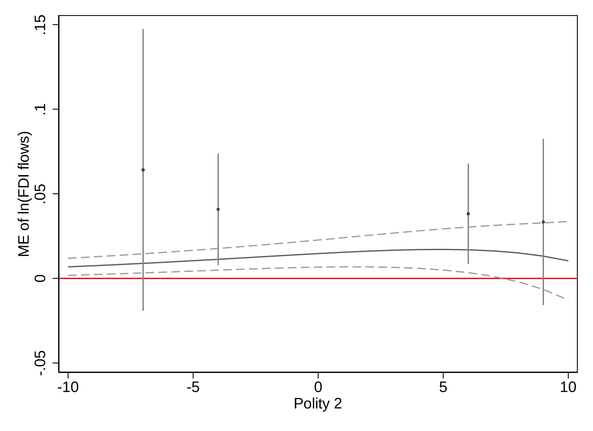

# Required packages

This document illustrates how to generate plots with
distribution-weighted average marginal effects (DAME) and heatmaps and
contour plots for the marginal effects in Stata. We use the same
examples as Zhirnov, Moral, and Sedashov (2022), but simpler Stata code.
In addition to the standard Stata and Mata commands, you will need to
install the `moremata` package (Jann 2005), which can be downloaded from
`ssc`:

    ssc install moremata

# Obtaining the datasets

We will need four datasets, which are part of the replication materials
of the studies we replicate. These datasets are publicly available, and
in this section, we show how you can obtain them.

### Pre-electoral coalition formation (G)

The dataset was created by Sona Golder and used in her book (Golder
2006) on electoral alliances. It can be found on Matt Golder’s website
at
[http://mattgolder.com/files/interactions/interaction3.zip/](http://mattgolder.com/files/interactions/interaction3.zip)
under the name “interaction3.dta.”

### Voter registration rules and turnout (N)

The dataset was originally used by Nagler (1991) and made public by
William D. Berry, Jacqueline H. R. DeMeritt, and Justin Esarey as part
of the replication materials for Berry, DeMeritt, and Esarey (2010). The
file can be downloaded from
<https://jdemeritt.weebly.com/uploads/2/2/7/7/22771764/bde.zip>; it is
named as “scobit.dta.”

### News media and party discipline (AJLW)

The dataset is part of the published replication materials for Arceneaux
et al. (2016) and can be downloaded from the Harvard Dataverse
(<https://dataverse.harvard.edu/dataset.xhtml?persistentId=doi:10.7910/DVN/27597>).
We use the original, Stata version of the “FoxNews\_Master.tab” file.

### Foreign direct investment and labor protest (RT)

The dataset is part of the published replication materials for Robertson
and Teitelbaum (2011) and can be downloaded from Emmanuel Teitelbaum’s
website <https://home.gwu.edu/~ejt/pages/Data.html>, or directly from
<https://home.gwu.edu/~ejt/pages/Data_files/Robertson%20Teitelbaum%202011.dta>.

# Pre-electoral coalition formation (G)

Golder (2006) looks into the determinants of the pre-electoral coalition
formation. One of the hypotheses is that “party system polarization
increases the likelihood of pre-electoral coalitions when the electoral
system is sufficiently disproportional” (p. 87). Using a dataset of
party dyads in examined elections (G), the study estimates a model that
predicts whether a particular party dyad enters the same alliance and
includes polarization, effective electoral threshold (as a measure of
the restrictiveness of the electoral system), and their interaction term
as the predictors.

### Load the data and estimate the main model

This analysis uses a random-effects probit model with an interaction
term, which can be estimated using Stata’s default `xtprobit` command:

    clear all
    use interaction3.dta,clear

    xtprobit pec polarization threshold polarization_threshold seatshare seatshare_2 incompatibility ///
          asymmetry asym_seat, re i(ident)

    Fitting comparison model:

    Iteration 0:   log likelihood = -749.41197  
    Iteration 1:   log likelihood = -683.54241  
    Iteration 2:   log likelihood = -681.29839  
    Iteration 3:   log likelihood =  -681.2926  
    Iteration 4:   log likelihood =  -681.2926  

    Fitting full model:

    rho =  0.0     log likelihood =  -681.2926
    rho =  0.1     log likelihood = -646.84249
    rho =  0.2     log likelihood = -637.69168
    rho =  0.3     log likelihood = -637.02544
    rho =  0.4     log likelihood =  -640.3162

    Iteration 0:   log likelihood = -636.85364  
    Iteration 1:   log likelihood = -626.69411  
    Iteration 2:   log likelihood = -625.68214  
    Iteration 3:   log likelihood = -625.67261  
    Iteration 4:   log likelihood = -625.67261  (backed up)

    Random-effects probit regression                     Number of obs    =  3,495
    Group variable: ident                                Number of groups =    278

    Random effects u_i ~ Gaussian                        Obs per group:
                                                                      min =      1
                                                                      avg =   12.6
                                                                      max =     55

    Integration method: mvaghermite                      Integration pts. =     12

                                                         Wald chi2(8)     =  85.48
    Log likelihood = -625.67261                          Prob > chi2      = 0.0000

    ------------------------------------------------------------------------------
             pec | Coefficient  Std. err.      z    P>|z|     [95% conf. interval]
    -------------+----------------------------------------------------------------
    polarization |   -.003196   .0054598    -0.59   0.558    -.0138971    .0075051
       threshold |   .0191695   .0108315     1.77   0.077    -.0020599    .0403989
    polarizati~d |   .0005275   .0002845     1.85   0.064      -.00003    .0010851
       seatshare |    .052641   .0114296     4.61   0.000     .0302394    .0750426
     seatshare_2 |  -.0005782   .0001095    -5.28   0.000    -.0007928   -.0003636
    incompatib~y |  -.0075775   .0025334    -2.99   0.003    -.0125428   -.0026122
       asymmetry |  -.0710249   .2988559    -0.24   0.812    -.6567716    .5147218
       asym_seat |  -.0301315   .0088792    -3.39   0.001    -.0475344   -.0127286
           _cons |  -2.381516   .3134815    -7.60   0.000    -2.995928   -1.767103
    -------------+----------------------------------------------------------------
        /lnsig2u |  -.5068768     .24457                     -.9862252   -.0275283
    -------------+----------------------------------------------------------------
         sigma_u |   .7761276   .0949088                      .6107225    .9863301
             rho |    .375926   .0573775                      .2716583    .4931184
    ------------------------------------------------------------------------------
    LR test of rho=0: chibar2(01) = 111.24                 Prob >= chibar2 = 0.000

Before we can proceed to computing marginal effects, we need to trim the
dataset to keep only the used observations and save it as a file.

    keep if e(sample)
    save temp, replace

We also need to simulate the distribution of coefficients and push it to
Stata’s matrix environment, Mata:

    matrix beta=e(b)[.,e(depvar) + ":"]
    matrix vcov=e(V)[e(depvar) + ":",e(depvar) + ":"]
     
    drawnorm coef1-coef`=colsof(beta)', n(10000) means(beta) cov(vcov) clear
    putmata coef=(*), replace

We also need to define three Mata functions:

    mata
    /* me() returns the partial derivative of the predicted
    values of the dependent variable; 
     it uses a matrix of covariate values needed to compute 
     the linear prediction of the model (x) and a matrix of
     covariate values needed to compute the linear component 
     of the first derivative of the predicted value of the 
     dependent variable (z).*/
    real matrix me(coef, x, z) {
    int_coef_names = ("polarization","polarization_threshold")
    /* The coefficients used to compute the derivative of the linear prediction */
    nam = st_matrixcolstripe("beta")
    k = J(cols(int_coef_names),1,.)
    for (j=1; j<=cols(int_coef_names); j++) {
     k[j] = selectindex(nam[.,2]:==int_coef_names[j])
    }
    dydx = (coef[.,k]*z'):*normalden(coef*x')
    /* Replace normalden() with the derivative of the inverse link function as needed */
    return(dydx)
    }
    /* me_byrow() returns a vector of marginal effects by row; this function uses me() 
    internally */
    real matrix me_byrow(coef, X, Z) {
    dydx=me(coef, X, Z)
    means=mean(dydx)'
    ra=mm_quantile(dydx, 1, (0.025 \ 0.975))'/* Confidence level can be changed here */
    return((means,ra))
    } 
    /* me_wt() returns a vector of weighted average marginal effects; this function uses me() internally */
    real matrix me_wt(coef, X, Z, group_id, weight) {
    dydx=me(coef, X, Z)
    groups=uniqrows(group_id)
    wtm=J(cols(dydx), rows(groups), .)
    obs=J(rows(groups),1,.)
    for (i=1; i<=rows(groups); i++) {
        wtmc=(group_id:==groups[i]):*weight
        obs[i]=sum(wtmc)
        wtm[.,i]=wtmc/sum(wtmc)
        }
    dydxw=dydx*wtm
    means=mean(dydxw)'
    ra=mm_quantile(dydxw, 1, (0.025 \ 0.975))' /* Confidence level can be changed here */
    return((groups,obs,means,ra))
    }
    end

The above-defined function `me()` will calculate the partial derivatives
of the predicted value of the dependent variable using the supplied
matrix of the covariates and the simulated matrix of coefficients.

### Plotting marginal effects of polarization

Replace the values of the covariates (except the constitutive terms)
with their means and compute the marginal effects of polarization.

    use temp,clear
    foreach var of varlist seatshare incompatibility asymmetry {
    qui sum `var'
    replace `var'=r(mean)
    }

    collapse (mean) seatshare incompatibility asymmetry (count) obs=seatshare, ///
       by(polarization threshold)

    gen polarization_threshold=polarization*threshold
    gen seatshare_2=seatshare^2
    gen asym_seat=seatshare*asymmetry

    putmata wt=obs ///
       X=(polarization threshold polarization_threshold seatshare seatshare_2 ///
            incompatibility asymmetry asym_seat 1) ///
       Z=(1 threshold), replace
    mata: mebr=me_byrow(coef, X, Z)
    getmata (me_est lb ub)=mebr

    gen significant=(lb>0 & ub>0)|(lb<0 & ub<0)

Now, use `twoway contourplot` to create a contour plot showing marginal
effects of polarization (`me_est`) on two dimensions: one showing the
values of `polarization` and another showing the values of `threshold`.
We might want to add extra observations to anchor the scatter sizes.
Additional observations 2 and 3, as defined below, will correspond to
the unplotted filled and hollow markers of the same size, equal to the
size of the largest marker of either type. Additional observations 1 and
4 correspond to the unplotted filled and hollow markers of the size
equal to that of the smallest marker of either type.

    gen counter=_n
    qui sum counter
    loc extra1=`=r(max)'+1
    loc extra2=`=r(max)'+2
    loc extra3=`=r(max)'+3
    loc extra4=`=r(max)'+4
    set obs `extra4'

    qui sum obs
    replace significant=1 in `extra1'/`extra2'
    replace significant=0 in `extra3'/`extra4'
    replace obs=`=r(min)' in `extra1'/`extra4'
    replace obs=`=r(max)' in `extra2'/`extra3'

    ** break the ME values into steps
    qui sum me_est,detail
    loc locut=`r(min)' +(`r(max)'-`r(min)')*1/4
    loc medcut=`r(min)'+(`r(max)'-`r(min)')*2/4
    loc hicut=`r(min)' +(`r(max)'-`r(min)')*3/4
    loc minest =`r(min)'
    loc maxest =`r(max)'

    local colr = "white*0.5 yellow*0.5 orange*0.5 red*0.5"
    /* color ramp: from less intense to more intense colors */

    twoway (contour me_est polarization threshold if me_est!=., ///
       ccuts(`locut' `medcut' `hicut') ccolors(`colr')) ///
          (scatter polarization threshold [fw=obs] if significant==0, ///
       msymbol(oh) mlcolor(black%95) mlwidth(vthin) msize(*.25)) /// 
          (scatter polarization threshold [fw=obs] if significant==1, ///
       msymbol(o) mfcolor(black%95) mlwidth(none) msize(*.25)), ///
          xtitle(Threshold) ytitle(Polarization) ztitle("") ///
       zlabel(`minest' `locut' `medcut' `hicut' `maxest') ///
          legend(off)  clegend(title("Effect Size", ///
       size(medsmall) pos(12) justification(right)) width(5) height(25)) 

To create a heatmap instead of a contour plot, we can use the `crule`
option instead of `ccuts` in the `twoway contour` syntax:

    qui sum counter
    loc extra1=`=r(max)'+1
    loc extra2=`=r(max)'+2
    loc extra3=`=r(max)'+3
    loc extra4=`=r(max)'+4
    set obs `extra4'

    qui sum obs
    replace significant=1 in `extra1'/`extra2'
    replace significant=0 in `extra3'/`extra4'
    replace obs=`=r(min)' in `extra1'/`extra4'
    replace obs=`=r(max)' in `extra2'/`extra3'

    * color ramp: from less intense to more intense colors
    loc scolr="yellow*.25" /* starting color */
    loc ecolr="red*.95" /* color at the high end */

    * variable grid
    qui sum polarization [fw=obs] 
    loc x1max: disp %9.1f r(max)
    loc x1min: disp %9.1f r(min)
    loc s1=round((`x1max'-`x1min')/4, 0.1)
    /* Number of ticks on the y axis can be changed here or changing the "ylab" option below */

    qui sum threshold [fw=obs]
    loc x2max: disp %9.4f r(max)
    loc x2min: disp %9.4f r(min)
    loc s2=round((`x2max'-`x2min')/4, 0.0001)       

    twoway (contour me_est polarization threshold if me_est!=., ///
          levels(100) crule(linear) scolor(`scolr') ecolor(`ecolr') zlab(#5, labsize(medsmall))) ///
       (scatter polarization threshold [fw=obs] if significant==0, ///
          msymbol(oh) mlcolor(black%95) mlwidth(vthin) msize(*.25)) ///
       (scatter polarization threshold [fw=obs] if significant==1, ///
          msymbol(o) mfcolor(black%95) mlwidth(none) msize(*.25)), ///
       xsca(alt) ysca(alt) xtitle("") ytitle("") ztitle("") ///
       ylab(`x1min'(`s1')`x1max', grid gmax labsize(medsmall)) ///
       xlab(`x2min'(`s2')`x2max', labsize(medsmall) grid gmax) /// 
       legend(off) clegend(title("Effect Size", size(medsmall) pos(12) justification(right)) ///
       ring(0) width(5) height(25)) name(yx, replace)

    /* to add histograms */
    twoway histogram threshold [fw=obs], frac ysca(alt reverse) ///
       xtitle("Effective Electoral Threshold", size(medsmall)) ytitle("") ///
       xlab(`x2min'(`s2')`x2max')///
       ylab(#4, nogrid labsize(medsmall))  ///
       fysize(20) fcolor(black%95) lwidth(vthin) lcolor(white%25) nodraw name(hy, replace) 

    twoway histogram polarization [fw=obs], frac xsca(alt reverse) ///
       horiz ytitle("Polarization", size(medsmall)) xtitle("") ///
       ylab(`x1min'(`s1')`x1max') ///
       xlab(#4, nogrid labsize(medsmall)) ///
       fxsize(20) fcolor(black%95) lwidth(vthin) lcolor(white%25) nodraw name(hx, replace)

    gr combine hx yx hy, hole(3) imargin(zero) scale(1.1) xsize(5.5) ysize(5.5)

### Computing and plotting DAME of polarization

To compute the distribution-weighted average marginal effects, we first
need to break the dataset into bins according to the values of the
conditioning variable (`threshold`). We use `xtile` to create a variable
with 10 groups of observations of approximately equal size and find the
middle value of that variable for plotting.

    use temp,clear
    gen wt=1
    xtile group_id = threshold, nq(10)
    egen midpoint=median(threshold),by(group_id)

Now we push this information to Mata and apply the `me_wt()` function.
We supply a matrix of all values for all covariates as `X` and a matrix
of the variables used in the linear component of the first derivative as
`Z`.

    putmata wt=wt ///
      group_id=midpoint ///
      X=(polarization threshold polarization_threshold seatshare seatshare_2 ///
           incompatibility asymmetry asym_seat 1) ///
      Z=(1 threshold), replace
    mata: dame=me_wt(coef, X, Z, group_id, wt)

To compute the marginal effects of polarization at its mean, we create a
new dataset with the conditioning variable (`threshold`) taking 21
values spanning over its range and all other covariates set to their
means:

    use temp,clear
    qui sum threshold
    loc mn=r(min)
    loc mx=r(max)
    collapse (mean) polarization seatshare incompatibility asymmetry
    expand 21
    gen threshold=`mn' + (_n-1)*(`mx'-`mn')/20
    gen polarization_threshold=polarization*threshold
    gen seatshare_2=seatshare^2
    gen asym_seat=seatshare*asymmetry

    putmata X=(polarization threshold polarization_threshold seatshare seatshare_2 ///
                 incompatibility asymmetry asym_seat 1) Z=(1 threshold), replace
    mata: mem=me_byrow(coef, X, Z)

Push DAME and MEM estimates from Mata into Stata’s active dataset and
make a plot:

    getmata (mem lbm ubm)=mem
    getmata (midpoint obs dame_est lb ub)=dame, force

    twoway (line mem threshold, lpattern(solid)) ///
    (rline lbm ubm threshold, lpattern(dash)) ///
    (rspike lb ub midpoint) ///
    (scatter dame_est midpoint [fw=obs], msymbol(o) msize(*.25)), /// 
    yline(0, lcolor(red)) ytitle("DAME/MEM of polarization") ///
      xtitle("Effective Electoral Threshold") legend(off)

# Voter registration rules and turnout (N)

Nagler (1991) examines the interactive effect of education and the
restrictiveness of electoral registration rules on turnout. The latter
is measured using the number of days before the election when the
registration closes (`closing`). This variable takes on the value of 0
when the voters are allowed to register on the election day, and 30
means that the registration closes 30 days before the election day. The
education is captured with an 8-category variable (`neweduc`), which is
treated as a quantitative variable. The model also includes the squared
value of `neweduc` (i.e., `educ2`). The main hypothesis is conditional:
more restrictive registration rules primarily hurt less educated
individuals.

### Load the data and estimate the model

This expectation is captured using a probit model including the
interaction terms of `closing` and `neweduc`, and `closing` and `educ2`:

    clear all
    use scobit.dta,clear
    drop if newvote==-1
    probit newvote closing neweduc educ2 cloeduc cloeduc2 age age2 south gov

    (0 observations deleted)

    Iteration 0:   log likelihood = -63205.249  
    Iteration 1:   log likelihood = -55865.033  
    Iteration 2:   log likelihood = -55815.316  
    Iteration 3:   log likelihood = -55815.275  
    Iteration 4:   log likelihood = -55815.275  

    Probit regression                                     Number of obs =   99,676
                                                          LR chi2(9)    = 14779.95
                                                          Prob > chi2   =   0.0000
    Log likelihood = -55815.275                           Pseudo R2     =   0.1169

    ------------------------------------------------------------------------------
         newvote | Coefficient  Std. err.      z    P>|z|     [95% conf. interval]
    -------------+----------------------------------------------------------------
         closing |   .0006238   .0037082     0.17   0.866     -.006644    .0078917
         neweduc |   .2645073    .041586     6.36   0.000     .1830003    .3460144
           educ2 |   .0050701   .0041567     1.22   0.223    -.0030769    .0132171
         cloeduc |  -.0031723   .0014993    -2.12   0.034    -.0061108   -.0002337
        cloeduc2 |   .0002773   .0001504     1.84   0.065    -.0000175    .0005722
             age |   .0696593   .0013051    53.37   0.000     .0671013    .0722172
            age2 |  -.0005061   .0000134   -37.71   0.000    -.0005324   -.0004798
           south |    -.11548   .0109736   -10.52   0.000    -.1369877   -.0939722
             gov |   .0034307   .0116343     0.29   0.768    -.0193722    .0262335
           _cons |  -2.743104   .1073858   -25.54   0.000    -2.953576   -2.532631
    ------------------------------------------------------------------------------

As earlier, we need to trim the dataset in memory to keep only the used
observations and save it as a new data file. We also need to simulate
the distribution of coefficients and push it to Mata:

    keep if e(sample)
    save temp, replace
    matrix beta=e(b)[.,e(depvar) + ":"]
    matrix vcov=e(V)[e(depvar) + ":",e(depvar) + ":"]
     
    drawnorm coef1-coef`=colsof(beta)', n(10000) means(beta) cov(vcov) clear
    putmata coef=(*), replace

To make calculations, we need to define three Mata functions:

    mata
    /* me() returns a vector of first-differences and relies on a matrix with 
    and without the increment added to the variable of interest */
    real matrix me(coef, x, x_new) {
    dydx=normal(coef*x_new')-normal(coef*x')
    /* Replace normal() with the appropriate function as needed */
    return(dydx)
    }
    /* me_byrow() returns marginal effects by row along with the confidence intervals;
       this function uses me() internally */
    real matrix me_byrow(coef, X, Z) {
    dydx=me(coef, X, Z)
    means=mean(dydx)'
    ra=mm_quantile(dydx, 1, (0.025 \ 0.975))' /* Confidence level can be changed here */
    return((means,ra))
    } 
    /* me_wt() returns weighted averages of marginal effects; 
       this function uses me() internally */
    real matrix me_wt(coef, X, Z, group_id, weight) {
    dydx=me(coef, X, Z)
    groups=uniqrows(group_id)
    wtm=J(cols(dydx), rows(groups), .)
    obs=J(rows(groups),1,.)
    for (i=1; i<=rows(groups); i++) {
        wtmc=(group_id:==groups[i]):*weight
        obs[i]=sum(wtmc)
        wtm[.,i]=wtmc/sum(wtmc)
        }
    dydxw=dydx*wtm
    means=mean(dydxw)'
    ra=mm_quantile(dydxw, 1, (0.025 \ 0.975))'
    /* Confidence level can be changed here */
    return((groups,obs,means,ra))
    }
    end

The above-defined function `me()` will calculate the first difference in
the model predictions using the supplied matrix of the covariates, a
matrix of the covariates with the increment added to the main variable
of interest (for which we are computing the marginal effects), and the
matrix of coefficient estimates.

### Plotting marginal effects of the restrictiveness of electoral registration rules

Replace `age` with its mean and `south` and `gov` with their modes,
collapse the dataset, and push it to Mata. At this step, we also
condense the dataset by collapsing the dataset in memory by the unique
values of `closing` and `neweduc` while generating a variable with the
number of observations that take those values (`obs`).

    use temp,clear
    egen age1=mean(age)
    egen south1=mode(south)
    egen gov1=mode(gov)
    collapse (mean) age=age1 south=south1 gov=gov1 (count) obs=age1, by(closing neweduc)

    gen age2=age^2
    gen educ2=neweduc^2
    gen cloeduc=closing*neweduc
    gen cloeduc2=closing*neweduc^2
     
    putmata X=(closing neweduc educ2 cloeduc cloeduc2 age age2 south gov 1), replace

To apply the first differencing method to compute the marginal effect of
education, add the increment of 1 to `closing`. We then push the new
dataset to Mata and apply the `me_byrow()` function.

    preserve
    replace closing = closing+1
    replace cloeduc = closing*neweduc
    replace cloeduc2 = closing*educ2
    putmata X1=(closing neweduc educ2 cloeduc cloeduc2 age age2 south gov 1), replace
    restore

    mata: mebr=me_byrow(coef, X, X1)
    getmata (me_est lb ub)=mebr

    gen significant=(lb>0 & ub>0)|(lb<0 & ub<0)

Now, create a contour plot with the marginal effects of the registration
rules. We might want to add extra observations to anchor the sizes of
filled and hollow markers to the same largest and smallest values.

    gen counter=_n
    qui sum counter
    loc extra1=`=r(max)'+1
    loc extra2=`=r(max)'+2
    loc extra3=`=r(max)'+3
    loc extra4=`=r(max)'+4
    set obs `extra4'

    qui sum obs
    replace significant=1 in `extra1'/`extra2'
    replace significant=0 in `extra3'/`extra4'
    replace obs=`=r(min)' in `extra1'/`extra4'
    replace obs=`=r(max)' in `extra2'/`extra3'

    ** break the ME values into steps
    qui sum me_est,detail
    loc locut=`r(min)' +(`r(max)'-`r(min)')*1/4
    loc medcut=`r(min)'+(`r(max)'-`r(min)')*2/4
    loc hicut=`r(min)' +(`r(max)'-`r(min)')*3/4
    loc minest =`r(min)'
    loc maxest =`r(max)'

    local colr = "red*.5 orange*.5 yellow*.5 white*.5" 
    /* Color ramp from more intense to less intense colors */

    twoway (contour me_est closing neweduc if me_est!=., ///
            ccuts(`locut' `medcut' `hicut') ccolors(`colr')) ///
        (scatter closing neweduc [fw=obs] if significant==0, ///
           msymbol(oh) mlcolor(black%95) mlwidth(vthin) msize(*.25)) /// 
    (scatter closing neweduc [fw=obs] if significant==1, ///
       msymbol(o) mfcolor(black%95) mlwidth(none) msize(*.25)), ///
      xtitle(Education) ytitle(Closing Date) ///
      ztitle("") zlabel(`minest' `locut' `medcut' `hicut' `maxest') ///
    legend(off)  clegend(title("Effect Size", size(medsmall) pos(12) ///
      justification(right)) width(5) height(25)) 

### Computing and plotting DAME of the restrictiveness of electoral registration rules

To make calculations faster, we first condense the dataset. We keep only
unique values of covariates and create a variable to store the number of
actual observations that have those values (`wt`).

    use temp,clear
    collapse (count) wt=newvote, by(closing neweduc age south gov)
    gen age2=age^2
    gen educ2=neweduc^2
    gen cloeduc=closing*neweduc
    gen cloeduc2=closing*neweduc^2

Now we push this information to Mata and apply the `me_wt()` function.
We use the unique values of `neweduc` to bin the observations:

    putmata wt=wt group_id=neweduc ///
         X=(closing neweduc educ2 cloeduc cloeduc2 age age2 south gov 1), replace

As before, with the first differences method, we need to add an
increment to the main explanatory variable (`closing`) and push this
dataset to Mata. We apply `me_wt()` to compute the weighted averages of
in-sample marginal effects with confidence intervals.

    preserve
    replace closing = closing+1
    replace cloeduc = closing*neweduc
    replace cloeduc2 = closing*educ2
    putmata X1=(closing neweduc educ2 cloeduc cloeduc2 age age2 south gov 1), replace
    restore

    mata: dame=me_wt(coef, X, X1, group_id, wt)

To compute the marginal effects of `closing` at its mean and each of the
unique values of `neweduc`, we create a new dataset with the `age` and
`closing` set to their means and `south` and `gov` set to their modes.

    use temp,clear
    qui sum neweduc
    loc mn=r(min)
    loc mx=r(max)

    collapse (mean) age closing (median) south gov
    expand 21
    gen neweduc=`mn' + (_n-1)*(`mx'-`mn')/20
    gen educ2=neweduc^2
    gen cloeduc=closing*neweduc
    gen cloeduc2=closing*educ2
    gen age2=age^2

    putmata X=(closing neweduc educ2 cloeduc cloeduc2 age age2 south gov 1), replace

Applying the first-differences method requires adding an increment to
the main variable of interest. We add an increment of 1 (1 day) to
`closing` and push the resulting dataset to Mata:

    preserve
    replace closing = closing+1
    replace cloeduc = closing*neweduc
    replace cloeduc2 = closing*educ2
    putmata X1=(closing neweduc educ2 cloeduc cloeduc2 age age2 south gov 1), replace
    restore
    mata: mem=me_byrow(coef, X, X1)

Copy the DAME and MEM estimates from Mata into Stata’s active dataset
and produce a plot:

    getmata (mem lbm ubm)=mem
    getmata (midpoint obs dame_est lb ub)=dame, force

    twoway (line mem neweduc, lpattern(solid)) ///
    (rline lbm ubm neweduc, lpattern(dash)) ///
    (rspike lb ub midpoint) ///
    (scatter dame_est midpoint [fw=obs], msymbol(o) msize(*.25)), /// 
    yline(0, lcolor(red)) ytitle("DAME/MEM of Closing date") xtitle("Education") legend(off)

# News media and party discipline (AJLW)

Arceneaux et al. (2016) view Congressmen as facing a choice between
voting with the party and more closely following the preferences of
their constituencies. Politicians are expected to vote with their party
when they can afford to do so when the next election is sufficiently
far, their district is safe, or they can shape the public opinion in
their districts. The article presents several hypotheses about the
interactive effects of these factors, but in the interest of space, we
focus here only on the interaction between competitiveness and the
proximity of elections.

### Load the data and estimate the model

To examine the interactive effect of district competitiveness and the
proximity of the next election, following Arceneaux et al. (2016), we
subset the data and examine the Republicans from the districts in which
Fox News was present (this is another explanatory variable in the
authors’ study) and build a model explaining whether a Congressman voted
with their party and including a full interaction term of the polynomial
of the number of days until the next election and the Democratic vote
share in the preceding election in the representative’s district (the
larger this share, the more competitive the district).

    clear all
    use FoxNews_Master.dta,clear
    gen dvprop=dv/100
    gen daysdv=daystoelection*dvprop
    gen days2dv=daystoelection2*dvprop
    gen days3dv=daystoelection3*dvprop

    logit PartyVote daystoelection daystoelection2 daystoelection3 dvprop daysdv days2dv days3dv ///
          Retirement seniorit qualchal_lag qualchal spendgap_lag spendgap distpart_lag RegPass Susp ///
      OtherPass Amend ProPart if PresencePartyUnity==1 & Republican==1 & FoxNews==1, cluster(dist2)

    (2,080 missing values generated)

    (2,080 missing values generated)

    (2,080 missing values generated)

    (2,080 missing values generated)

    Iteration 0:   log pseudolikelihood = -21866.053  
    Iteration 1:   log pseudolikelihood = -19635.905  
    Iteration 2:   log pseudolikelihood = -19349.274  
    Iteration 3:   log pseudolikelihood = -19345.854  
    Iteration 4:   log pseudolikelihood = -19345.849  
    Iteration 5:   log pseudolikelihood = -19345.849  

    Logistic regression                                     Number of obs = 57,086
                                                            Wald chi2(18) =      .
                                                            Prob > chi2   =      .
    Log pseudolikelihood = -19345.849                       Pseudo R2     = 0.1153

                                     (Std. err. adjusted for 73 clusters in dist2)
    ------------------------------------------------------------------------------
                 |               Robust
       PartyVote | Coefficient  std. err.      z    P>|z|     [95% conf. interval]
    -------------+----------------------------------------------------------------
    daystoelec~n |  -.0053586    .006298    -0.85   0.395    -.0177025    .0069852
    daystoelec~2 |   .0000157   .0000199     0.79   0.430    -.0000233    .0000548
    daystoelec~3 |  -1.50e-08   1.92e-08    -0.78   0.435    -5.27e-08    2.27e-08
          dvprop |    .998589   2.279036     0.44   0.661    -3.468239    5.465417
          daysdv |   .0110505    .018106     0.61   0.542    -.0244367    .0465376
         days2dv |  -.0000448   .0000578    -0.77   0.439     -.000158    .0000685
         days3dv |   5.76e-08   5.64e-08     1.02   0.307    -5.30e-08    1.68e-07
      Retirement |    1.01544   .1738517     5.84   0.000     .6746974    1.356184
        seniorit |  -.0340132   .0238695    -1.42   0.154    -.0807966    .0127702
    qualchal_lag |   .2339622    .175486     1.33   0.182    -.1099841    .5779085
        qualchal |  -.1627822   .1762658    -0.92   0.356    -.5082568    .1826924
    spendgap_lag |   .0166931   .0408697     0.41   0.683      -.06341    .0967961
        spendgap |  -.0477062   .0422487    -1.13   0.259    -.1305121    .0350996
    distpart_lag |   6.657421   1.367335     4.87   0.000     3.977493    9.337348
         RegPass |  -1.228186   .0917791   -13.38   0.000    -1.408069   -1.048302
            Susp |  -1.044197   .1444723    -7.23   0.000    -1.327358   -.7610369
       OtherPass |  -.9420381   .1077914    -8.74   0.000    -1.153305   -.7307708
           Amend |   -2.20396   .0958879   -22.98   0.000    -2.391897   -2.016023
         ProPart |  -.2191304   .0979501    -2.24   0.025    -.4111091   -.0271516
           _cons |  -.0737458   1.197516    -0.06   0.951    -2.420834    2.273343
    ------------------------------------------------------------------------------

As earlier, we need to trim the dataset in Stata’s memory to keep only
the observations in the estimation sample and save it as a new data
file. We also need to simulate the distribution of coefficients and push
it to Stata’s matrix environment Mata:

    keep if e(sample)
    save temp, replace
    matrix beta=e(b)[.,e(depvar) + ":"]
    matrix vcov=e(V)[e(depvar) + ":",e(depvar) + ":"]
     
    drawnorm coef1-coef`=colsof(beta)', n(10000) means(beta) cov(vcov) clear
    putmata coef=(*), replace

To make the calculations, we need to define three Mata functions:

    mata
    /* me() finds the difference in predicted values of the dependent variable
        computed with covariate matrices x and x_new*/
    real matrix me(coef, x, x_new) {
    dydx=logistic(coef*x_new') - logistic(coef*x')
      /* Replace logistic() with the appropriate link function as needed */
    return(dydx)
    }
    /* me_byrow() returns a vector of marginal effects by row; this function uses me() internally */
    real matrix me_byrow(coef, X, Z) {
    dydx=me(coef, X, Z)
    means=mean(dydx)'
    ra=mm_quantile(dydx, 1, (0.025 \ 0.975))'
    /* Confidence level can be changed here */
    return((means,ra))
    } 
    /* me_wt() returns a vector of weighted average marginal effects; this function uses me() internally */
    real matrix me_wt(coef, X, Z, group_id, weight) {
    dydx=me(coef, X, Z)
    groups=uniqrows(group_id)
    wtm=J(cols(dydx), rows(groups), .)
    obs=J(rows(groups),1,.)
    for (i=1; i<=rows(groups); i++) {
        wtmc=(group_id:==groups[i]):*weight
        obs[i]=sum(wtmc)
        wtm[.,i]=wtmc/sum(wtmc)
        }
    dydxw=dydx*wtm
    means=mean(dydxw)'
    ra=mm_quantile(dydxw, 1, (0.025 \ 0.975))' /* Confidence level can be changed here */
    return((groups,obs,means,ra))
    }
    end

The above-defined function `me()` will calculate the first difference in
the model predictions using the supplied matrix of the covariate values,
a matrix of the covariate values with the increment added to the main
variable of interest (for which we are computing the marginal effects),
and the matrix of coefficients.

### Plotting marginal effects of election proximity

Replace `seniorit`, `spendgap_lag`, `spendgap`, and `distpart_lag` with
their means, and `qualchal`, `qualchal_lag`, and `Retirement` with their
modes, and make sure that the dummy variables representing the vote type
correctly single out the modal type of the vote (in this case, this
means that `Amend=1` and all other dummy variables representing this
type are set to zero). We then collapse the dataset and push it to Mata.

    use temp, clear
    foreach x of varlist qualchal qualchal_lag Retirement {
    qui sum `x'
    replace `x'= (r(mean)>0.5)
    }

    foreach x of varlist seniorit spendgap_lag spendgap distpart_lag {
    qui sum `x'
    replace `x'=r(mean)
    }

    ** find the modal type of the vote
    local dummies Amend OtherPass ProPart RegPass Susp
    egen baseline = rowmax(`dummies')
    replace baseline = 1-baseline
    tabstat `dummies' baseline, save
    mata props = st_matrix("r(StatTotal)")
    mata st_local("modal", st_matrixcolstripe("r(StatTotal)")[selectindex(props :== max(props))[1,1],2])
    foreach v in `dummies' {
        replace `v'=0
    }
    replace `modal'=1 if "`modal'"! = "baseline"

    /* round the values of the constitutive terms to avoid overplotting */
    replace dvprop=round(dvprop,0.02) 
    replace daystoelection=round(daystoelection,10)
    collapse (mean) Amend OtherPass ProPart qualchal qualchal_lag RegPass Retirement ///
       Susp seniorit spendgap_lag spendgap distpart_lag (count) obs=Amend, by(daystoelection dvprop) 
    gen daystoelection2=daystoelection^2
    gen daystoelection3=daystoelection^3
    gen daysdv=daystoelection*dvprop
    gen days2dv=daystoelection2*dvprop
    gen days3dv=daystoelection3*dvprop

    putmata wt=obs X=(daystoelection daystoelection2 daystoelection3 dvprop daysdv ///
        days2dv days3dv Retirement seniorit qualchal_lag qualchal spendgap_lag spendgap ///
        distpart_lag RegPass Susp OtherPass Amend ProPart 1), replace

To apply the first-differencing method to computing the marginal effect
of the number of days to the next election, we add the increment of 1 (1
day) to `daystoelection`. We then push the new dataset to Mata and apply
the `me_byrow()` function.

    preserve 
    replace daystoelection = daystoelection+1
    replace daystoelection2=daystoelection^2 
    replace daystoelection3=daystoelection^3
    replace daysdv=daystoelection*dvprop
    replace days2dv=daystoelection2*dvprop
    replace days3dv=daystoelection3*dvprop
    putmata X1=(daystoelection daystoelection2 daystoelection3 dvprop daysdv days2dv days3dv ///
                  Retirement seniorit qualchal_lag qualchal spendgap_lag spendgap distpart_lag ///
                  RegPass Susp OtherPass Amend ProPart 1), replace
    restore

    mata: mebr=me_byrow(coef, X, X1)
    getmata (me_est lb ub)=mebr

    gen significant=(lb>0 & ub>0)|(lb<0 & ub<0)

Now, create a contourplot. We might want to add extra observations to
anchor the sizes of filled and hollow markers to a common scale. It is
advisable to specify the color ramp in a way that more intense colors
represent negative and positive values of higher magnitude.

    gen counter=_n
    qui sum counter
    loc extra1=`=r(max)'+1
    loc extra2=`=r(max)'+2
    loc extra3=`=r(max)'+3
    loc extra4=`=r(max)'+4
    set obs `extra4'

    qui sum obs
    replace significant=1 in `extra1'/`extra2'
    replace significant=0 in `extra3'/`extra4'
    replace obs=`=r(min)' in `extra1'/`extra4'
    replace obs=`=r(max)' in `extra2'/`extra3'

    ** break the ME values into steps
    qui sum me_est,detail
    loc locut=`r(min)'+(`r(max)'-`r(min)')*1/5 
    loc lmedcut=`r(min)'+(`r(max)'-`r(min)')*2/5
    loc hmedcut=`r(min)'+(`r(max)'-`r(min)')*3/5
    loc hicut=`r(min)'+(`r(max)'-`r(min)')*4/5
    loc minest =`r(min)'
    loc maxest =`r(max)'

    loc colr= "navy*.5 ltblue*.5 white*.5 orange*.5 red*.5"
    /* color ramp: intense colors at both ends */

    twoway (contour me_est daystoelection dvprop if me_est!=., ///
           ccuts(`locut' `lmedcut' `hmedcut' `hicut') ccolors(`colr')) ///
       (scatter daystoelection dvprop [fw=obs] if significant==0, ///
          msymbol(oh) mlcolor(black%95) mlwidth(vthin) msize(*.25)) /// 
       (scatter daystoelection dvprop [fw=obs] if significant==1, ///
          msymbol(o) mfcolor(black%95) mlwidth(none) msize(*.25)), ///
       xtitle(Democratic Vote Share) ytitle(Days to Election) ztitle("") ///
       zlabel(`minest' `locut' `lmedcut' `hmedcut' `hicut' `maxest') ///
       legend(off)  clegend(title("Effect Size", ///
         size(medsmall) pos(12) justification(right)) width(5) height(25)) 

### Computing and plotting DAME of election proximity

To compute the distribution-weighted average marginal effects, we first
need to break the dataset into bins according to the values of the
conditioning variable (the Democratic vote share, `dvprop`). Here, we
use deciles:

    use temp,clear
    xtile group_id = dvprop, nq(10)
    egen midpoint=median(dvprop),by(group_id)

    collapse (count) wt=PartyVote, by(midpoint daystoelection dvprop Amend OtherPass ///
                    ProPart qualchal qualchal_lag RegPass Retirement Susp seniorit ///
                      spendgap_lag spendgap distpart_lag ) 
    gen daystoelection2=daystoelection^2
    gen daystoelection3=daystoelection^3
    gen daysdv=daystoelection*dvprop
    gen days2dv=daystoelection2*dvprop
    gen days3dv=daystoelection3*dvprop

Now we push this information to Mata:

    putmata wt=wt ///
      group_id=midpoint ///
      X=(daystoelection daystoelection2 daystoelection3 ///
              dvprop daysdv days2dv days3dv Retirement seniorit qualchal_lag qualchal spendgap_lag ///
              spendgap distpart_lag RegPass Susp OtherPass Amend ProPart 1), replace

As before, with the first differences method, we need to add an
increment to the main explanatory variable (`daystoelection`), push this
dataset to Mata. We apply the `me_wt()` function to find DAME with
confidence intervals.

    preserve 
    replace daystoelection = daystoelection+1
    replace daystoelection2=daystoelection^2 
    replace daystoelection3=daystoelection^3
    replace daysdv=daystoelection*dvprop
    replace days2dv=daystoelection2*dvprop
    replace days3dv=daystoelection3*dvprop
    putmata X1=(daystoelection daystoelection2 daystoelection3 dvprop daysdv ///
           days2dv days3dv Retirement seniorit qualchal_lag qualchal ///
          spendgap_lag spendgap distpart_lag RegPass Susp OtherPass Amend ProPart 1), replace
    restore

    mata: dame=me_wt(coef, X, X1, group_id, wt)

Compute the marginal effect of the proximity of the next election at its
mean, 21 equally-spaced values of the Democratic vote share, and the
means or modes of all other covariates:

    use temp,clear
    qui sum dvprop
    loc mn=r(min)
    loc mx=r(max)
    local dummies Amend OtherPass ProPart RegPass Susp
    egen baseline = rowmax(`dummies')
    replace baseline = 1-baseline
    tabstat `dummies' baseline, save
    mata props = st_matrix("r(StatTotal)")
    mata st_local("modal", st_matrixcolstripe("r(StatTotal)")[selectindex(props :== max(props))[1,1],2])

    collapse (mean) qualchal qualchal_lag Retirement daystoelection seniorit ///
          (median) spendgap_lag spendgap distpart_lag
    foreach v in `dummies' {
        gen `v'=0
    }
    replace `modal'=1 if "`modal'"! = "baseline"

    expand 21
    gen dvprop=`mn' + (_n-1)*(`mx'-`mn')/20
    gen daystoelection2=daystoelection^2
    gen daystoelection3=daystoelection^3
    gen daysdv=daystoelection*dvprop
    gen days2dv=daystoelection2*dvprop
    gen days3dv=daystoelection3*dvprop

    putmata X=(daystoelection daystoelection2 daystoelection3 dvprop daysdv days2dv ///
        days3dv Retirement seniorit qualchal_lag qualchal spendgap_lag spendgap ///
        distpart_lag RegPass Susp OtherPass Amend ProPart 1), replace
    preserve 
    replace daystoelection = daystoelection+1
    replace daystoelection2=daystoelection^2 
    replace daystoelection3=daystoelection^3
    replace daysdv=daystoelection*dvprop
    replace days2dv=daystoelection2*dvprop
    replace days3dv=daystoelection3*dvprop
    putmata X1=(daystoelection daystoelection2 daystoelection3 dvprop daysdv days2dv ///
       days3dv Retirement seniorit qualchal_lag qualchal spendgap_lag spendgap distpart_lag ///
       RegPass Susp OtherPass Amend ProPart 1), replace
    restore
     
    mata: mem=me_byrow(coef, X, X1)

Push DAME and MEM estimates from Mata into Stata’s active dataset and
produce a plot:

    getmata (mem lbm ubm)=mem
    getmata (midpoint obs dame_est lb ub)=dame, force

    * plot
    twoway (line mem dvprop, lpattern(solid)) ///
       (rline lbm ubm dvprop, lpattern(dash)) ///
       (rspike lb ub midpoint) ///
       (scatter dame_est midpoint [fw=obs], msymbol(o) msize(*.25)), /// 
       yline(0, lcolor(red)) ytitle("DAME/MEM of Days to Election") ///
       xtitle("Democratic Vote Share") legend(off)

# Foreign direct investment and labor protest (RT)

Robertson and Teitelbaum (2011) study the response of the local labor to
foreign direct investment. The article argues that FDI flows lead to
more labor protests, and this effect is more substantial when there are
fewer democratic means for resolving such conflicts.

### Load the data and estimate the model

Since the dependent variable is a count of protests, we use a negative
binomial regression (with random effects, as in the original study). The
right-hand side of the model equation includes an interaction of
political regime (Polity 2 score) and the natural log of FDI flows: the
latter’s effect is expected to be conditional on the values of the
former. Both variables are lagged.

    clear all
    use "Robertson Teitelbaum 2011.dta",clear

    tsset country year 
    gen l_l_flows=L.l_flows
    gen l_polity2=L.polity2
    gen l_dispute=L.dispute
    gen l_demflows=l_l_flows*l_polity2
     
    xtnbreg dispute l_l_flows l_polity2 l_demflows l_dispute open_penn l_gdp_pc_penn ///
         gdp_grth inflation_1 urban xratchg l_pop time, re 

    Panel variable: country (strongly balanced)
     Time variable: year, 1979 to 2006
             Delta: 1 unit

    (882 missing values generated)

    (635 missing values generated)

    (138 missing values generated)

    (1,074 missing values generated)

    Fitting negative binomial (constant dispersion) model:

    Iteration 0:   log likelihood = -19743.067  (not concave)
    Iteration 1:   log likelihood = -19693.709  (not concave)
    Iteration 2:   log likelihood = -19669.166  (not concave)
    Iteration 3:   log likelihood = -19419.284  (not concave)
    Iteration 4:   log likelihood = -13856.193  (not concave)
    Iteration 5:   log likelihood = -11966.288  (not concave)
    Iteration 6:   log likelihood =   -11310.6  (not concave)
    Iteration 7:   log likelihood = -10199.072  
    Iteration 8:   log likelihood = -9186.4974  (backed up)
    Iteration 9:   log likelihood = -6216.4679  (backed up)
    Iteration 10:  log likelihood = -3115.8005  (backed up)
    Iteration 11:  log likelihood = -2711.0594  
    Iteration 12:  log likelihood = -1142.8518  
    Iteration 13:  log likelihood = -1049.5331  
    Iteration 14:  log likelihood = -994.70272  
    Iteration 15:  log likelihood = -994.26758  
    Iteration 16:  log likelihood = -994.26733  
    Iteration 17:  log likelihood = -994.26733  

    Iteration 0:   log likelihood = -1138.5175  
    Iteration 1:   log likelihood = -1048.9393  
    Iteration 2:   log likelihood = -1043.1845  
    Iteration 3:   log likelihood = -1043.1752  
    Iteration 4:   log likelihood = -1043.1752  

    Iteration 0:   log likelihood = -1043.1752  (not concave)
    Iteration 1:   log likelihood = -974.09467  
    Iteration 2:   log likelihood = -939.21383  (not concave)
    Iteration 3:   log likelihood = -819.68488  
    Iteration 4:   log likelihood =  -786.2915  
    Iteration 5:   log likelihood = -781.86279  
    Iteration 6:   log likelihood = -781.78374  
    Iteration 7:   log likelihood =  -781.7837  

    Fitting full model:

    Iteration 0:   log likelihood = -768.40601  
    Iteration 1:   log likelihood = -724.05204  
    Iteration 2:   log likelihood = -718.95793  
    Iteration 3:   log likelihood = -718.92085  
    Iteration 4:   log likelihood = -718.92082  

    Random-effects negative binomial regression          Number of obs    =  2,348
    Group variable: country                              Number of groups =    131

    Random effects u_i ~ Beta                            Obs per group:
                                                                      min =      1
                                                                      avg =   17.9
                                                                      max =     25

                                                         Wald chi2(12)    = 162.80
    Log likelihood = -718.92082                          Prob > chi2      = 0.0000

    ------------------------------------------------------------------------------
         dispute | Coefficient  Std. err.      z    P>|z|     [95% conf. interval]
    -------------+----------------------------------------------------------------
       l_l_flows |   .3956329   .0843602     4.69   0.000       .23029    .5609758
       l_polity2 |   .2741761   .0597606     4.59   0.000     .1570476    .3913047
      l_demflows |  -.0323769   .0087734    -3.69   0.000    -.0495724   -.0151813
       l_dispute |   .0594588   .0192369     3.09   0.002     .0217551    .0971625
       open_penn |   .0007637   .0036998     0.21   0.836    -.0064878    .0080152
    l_gdp_pc_p~n |  -.1925234   .2337453    -0.82   0.410    -.6506558    .2656089
        gdp_grth |   -.028622   .0155615    -1.84   0.066    -.0591221     .001878
     inflation_1 |   .0001256   .0000684     1.84   0.066    -8.48e-06    .0002597
           urban |   .0219114   .0092731     2.36   0.018     .0037364    .0400863
         xratchg |   .0031663   .0038741     0.82   0.414    -.0044268    .0107595
           l_pop |   .3889047    .113996     3.41   0.001     .1654766    .6123328
            time |   .0322821   .0163049     1.98   0.048      .000325    .0642392
           _cons |  -10.22589   2.576873    -3.97   0.000    -15.27647   -5.175317
    -------------+----------------------------------------------------------------
           /ln_r |    1.07164   .2607792                      .5605223    1.582758
           /ln_s |  -.2429911   .3254917                     -.8809432    .3949609
    -------------+----------------------------------------------------------------
               r |   2.920165   .7615182                      1.751587    4.868364
               s |   .7842785   .2552761                      .4143919    1.484326
    ------------------------------------------------------------------------------
    LR test vs. pooled: chibar2(01) = 125.73               Prob >= chibar2 = 0.000

As earlier, we need to trim the dataset in memory to keep only the
observations in the estimation sample and save it as a new data file. We
also need to simulate the distribution of coefficients and push it to
Stata’s matrix environment Mata:

    keep if e(sample)
    save temp, replace
    matrix beta=e(b)[.,e(depvar) + ":"]
    matrix vcov=e(V)[e(depvar) + ":",e(depvar) + ":"]
     
    drawnorm coef1-coef`=colsof(beta)', n(10000) means(beta) cov(vcov) clear
    putmata coef=(*), replace

To make the calculations, we need to define three Mata functions:

    mata
    /* me() here returns the partial derivatives of the predicted values of the dependent 
        variable with for matrices with covariate values and coefficients  */
    real matrix me(coef, X, Z) {
    int_coef_names = ("l_l_flows","l_demflows")
      /* The coefficients used to compute the derivative of the linear component */
    nam=st_matrixcolstripe("beta")
    k=J(cols(int_coef_names),1,.)
    for (j=1; j<=cols(int_coef_names); j++) {
     k[j]=selectindex(nam[.,2]:==int_coef_names[j])
    }
    dydx=(coef[.,k]*Z'):*exp(coef*X')
    /* Replace exp() with the derivative of the inverse link function as needed */
    return(dydx)
    }
    /* me_byrow() returns a vector of marginal effects by row; this function uses me() internally */
    real matrix me_byrow(coef, X, Z) {
    dydx=me(coef, X, Z)
    means=mean(dydx)'
    ra=mm_quantile(dydx, 1, (0.025 \ 0.975))'/* Confidence level can be changed here */
    return((means,ra))
    } 
    /* me_wt() returns a vector of weighted average marginal effects; this function uses me() internally */
    real matrix me_wt(coef, X, Z, group_id, weight) {
    dydx=me(coef, X, Z)
    groups=uniqrows(group_id)
    wtm=J(cols(dydx), rows(groups), .)
    obs=J(rows(groups),1,.)
    for (i=1; i<=rows(groups); i++) {
        wtmc=(group_id:==groups[i]):*weight
        obs[i]=sum(wtmc)
        wtm[.,i]=wtmc/sum(wtmc)
        }
    dydxw=dydx*wtm
    means=mean(dydxw)'
    ra=mm_quantile(dydxw, 1, (0.025 \ 0.975))' /* Confidence level can be changed here */
    return((groups,obs,means,ra))
    }
    end

The above-defined function `me()` will calculate the partial derivatives
of the model prediction with respect to `l_l_flows` using the supplied
matrix of the covariate values and the matrix of coefficients.

### Plotting marginal effects of logged FDI flows

Replace the values of the covariates (except the constitutive terms)
with their means and compute the marginal effect of logged FDI flows
(`l_l_flows`). We also would like to bin the values of logged flows to
avoid overplotting later on.

    use temp,clear
    foreach y of varlist l_dispute open_penn l_gdp_pc_penn gdp_grth inflation_1 urban xratchg l_pop time {
    qui sum `y'
    replace `y'=r(mean)
    }

    egen l_flows1=cut(l_l_flows), at(-9.22, -7.22, -5.22, -3.22, -1.22, 1.22, 3.22, 5.22, 7.22, 9.22)
    egen flows_mean=mean(l_l_flows), by(l_flows1)
    replace l_l_flows=flows_mean
    collapse (mean) l_dispute open_penn l_gdp_pc_penn gdp_grth inflation_1 urban xratchg ///
      l_pop time (count) obs=dispute, by(l_l_flows l_polity2) 
    gen l_demflows = l_l_flows*l_polity2

    putmata X=(l_l_flows l_polity2 l_demflows l_dispute open_penn l_gdp_pc_penn gdp_grth ///
                 inflation_1 urban xratchg l_pop time 1) Z=(1 l_polity2) , replace
    mata: mebr=me_byrow(coef, X, Z)
    getmata (me_est lb ub)=mebr

    gen significant=(lb>0 & ub>0)|(lb<0 & ub<0)

Now, create a heatmap. We might want to add extra observations to anchor
the marker sizes on the scatter plot.

    gen counter=_n
    qui sum counter
    loc extra1=`=r(max)'+1
    loc extra2=`=r(max)'+2
    loc extra3=`=r(max)'+3
    loc extra4=`=r(max)'+4
    set obs `extra4'

    qui sum obs
    replace significant=1 in `extra1'/`extra2'
    replace significant=0 in `extra3'/`extra4'
    replace obs=`=r(min)' in `extra1'/`extra4'
    replace obs=`=r(max)' in `extra2'/`extra3'

    * color ramp: from less intense to more intense colors
    loc scolr="yellow*.25"
    loc ecolr="red*.95"

    * variable grid
    qui sum l_l_flows [fw=obs] 
    loc x1max: disp %9.1f r(max)
    loc x1min: disp %9.1f r(min)
    loc s1=round((`x1max'-`x1min')/4, 0.1)
    /* Number of ticks on the y axis can be changed here or changing the `ylab' option below */     
    qui sum l_polity2 [fw=obs]
    loc x2max: disp %9.4f r(max)
    loc x2min: disp %9.4f r(min)
    loc s2=round((`x2max'-`x2min')/4, 0.0001)       

    twoway (contour me_est l_l_flows l_polity2 if me_est!=., levels(100) crule(linear) ///
       scolor(`scolr') ecolor(`ecolr') zlab(#5, labsize(medsmall))) ///
       (scatter l_l_flows l_polity2 [fw=obs] if significant==0, ///
       msymbol(oh) mlcolor(black%95) mlwidth(vthin) msize(*.25)) ///
       (scatter l_l_flows l_polity2 [fw=obs] if significant==1, ///
       msymbol(o) mfcolor(black%95) mlwidth(none) msize(*.25)), ///
       xsca(alt) ysca(alt) xtitle("") ytitle("") ztitle("") ///
       ylab(`x1min'(`s1')`x1max', grid gmax labsize(medsmall)) ///
       xlab(`x2min'(`s2')`x2max', labsize(medsmall) grid gmax) /// 
       legend(off) clegend(title("Effect Size", size(medsmall) ///
       pos(12) justification(right)) ring(0) width(5) height(25)) nodraw name(yx, replace)
     
    twoway histogram l_polity2 [fw=obs], frac ysca(alt reverse) ///
       xtitle("Polity score", size(medsmall)) ytitle("") ///
       xlab(`x2min'(`s2')`x2max') ylab(#4, nogrid labsize(medsmall)) ///
       fysize(20) fcolor(black%95) lwidth(vthin) lcolor(white%25) nodraw name(hy, replace) 

    twoway histogram l_l_flows  [fw=obs], frac xsca(alt reverse) ///
       horiz ytitle("ln(FDI flows)", size(medsmall)) xtitle("") ///
       ylab(`x1min'(`s1')`x1max') xlab(#4, nogrid labsize(medsmall))///
       fxsize(20) fcolor(black%95) lwidth(vthin) lcolor(white%25) nodraw name(hx, replace)

    gr combine hx yx hy, hole(3) imargin(zero) scale(1.1) xsize(5.5) ysize(5.5)

### Computing and plotting DAME of the logged FDI flows:

To compute the distribution-weighted average marginal effects, we first
need to break the dataset into 4 bins based on the values of the
conditioning variable:

    use temp,clear
    gen wt=1
    xtile group_id = l_polity2, nq(4)
    egen midpoint=median(l_polity2),by(group_id)

Now we push this information to Mata and apply the `me_wt()` function:

    putmata wt=wt group_id=midpoint X=(l_l_flows l_polity2 l_demflows l_dispute open_penn ///
            l_gdp_pc_penn gdp_grth inflation_1 urban xratchg l_pop time 1) Z=(1 l_polity2) , replace
    mata: dame=me_wt(coef, X, Z, group_id, wt)

Compute the marginal effect of `l_l_flows` at its mean:

    use temp, replace
    qui sum l_polity2
    loc mn=r(min)
    loc mx=r(max)
    collapse (mean) l_dispute open_penn l_gdp_pc_penn gdp_grth inflation_1 urban xratchg l_pop ///
        time l_l_flows
    expand 21
    gen l_polity2=`mn' + (_n-1)*(`mx'-`mn')/20
    gen l_demflows = l_l_flows*l_polity2

    putmata X=(l_l_flows l_polity2 l_demflows l_dispute open_penn l_gdp_pc_penn gdp_grth inflation_1 ///
                 urban xratchg l_pop time 1) Z=(1 l_polity2) , replace
    mata: mem=me_byrow(coef, X, Z)

Push the DAME and MEM estimates from Mata into Stata’s active dataset
and make a plot:

    getmata (mem lbm ubm)=mem
    getmata (midpoint obs dame_est lb ub)=dame, force

    twoway (line mem l_polity2, lpattern(solid)) ///
    (rline lbm ubm l_polity2, lpattern(dash)) ///
    (rspike lb ub midpoint) ///
    (scatter dame_est midpoint [fw=obs], msymbol(o) msize(*.25)), /// 
    yline(0, lcolor(red)) ytitle("DAME/MEM of ln(FDI flows)") xtitle("Polity 2") legend(off)

# This document

This document was produced with RMarkdown Xie (2021), Hemken (2021)
using Stata 17.0 and R version 4.1.0.

# References

Allaire, JJ, Yihui Xie, Jonathan McPherson, Javier Luraschi, Kevin
Ushey, Aron Atkins, Hadley Wickham, Joe Cheng, Winston Chang, and
Richard Iannone. 2021. *Rmarkdown: Dynamic Documents for r*.
<https://github.com/rstudio/rmarkdown>.

Arceneaux, Kevin, Martin Johnson, Rene Lindstädt, and Ryan J. Vander
Wielen. 2016. “The Influence of News Media on Political Elites:
Investigating Strategic Responsiveness in Congress.” *American Journal
of Political Science* 60 (1): 5–29.

Berry, William, Jacqueline DeMeritt, and Justin Esarey. 2010. “Testing
for Interaction in Binary Logit and Probit Models: Is a Product Term
Essential?” *American Journal of Political Science* 54 (1): 248–66.

Golder, Sona. 2006. *The Logic of Pre-Electoral Coalition Formation*.
Columbus: Ohio State University Press.

Hemken, Doug. 2021. *Statamarkdown: ’Stata’ Markdown*.

Jann, Ben. 2005. *MOREMATA: Stata Module (Mata) to Provide Various
Functions*.

Nagler, Jonathan. 1991. “The Effect of Registration Laws and Education
on u.s. Voter Turnout.” *American Political Science Review* 85 (4):
1393–1405.

Robertson, Graeme B., and Emmanuel Teitelbaum. 2011. “Foreign Direct
Investment, Regime Type, and Labor Protest in Developing Countries.”
*American Journal of Political Science* 55 (3): 665–77.

Xie, Yihui. 2021. *Knitr: A General-Purpose Package for Dynamic Report
Generation in r*. <https://yihui.org/knitr/>.

Zhirnov, Andrei, Mert Moral, and Evgeny Sedashov. 2022. “Taking
Distributions Seriously: On the Interpretation of the Estimates of
Interactive Nonlinear Models.” *Political Analysis (Conditional
Acceptance)*.
