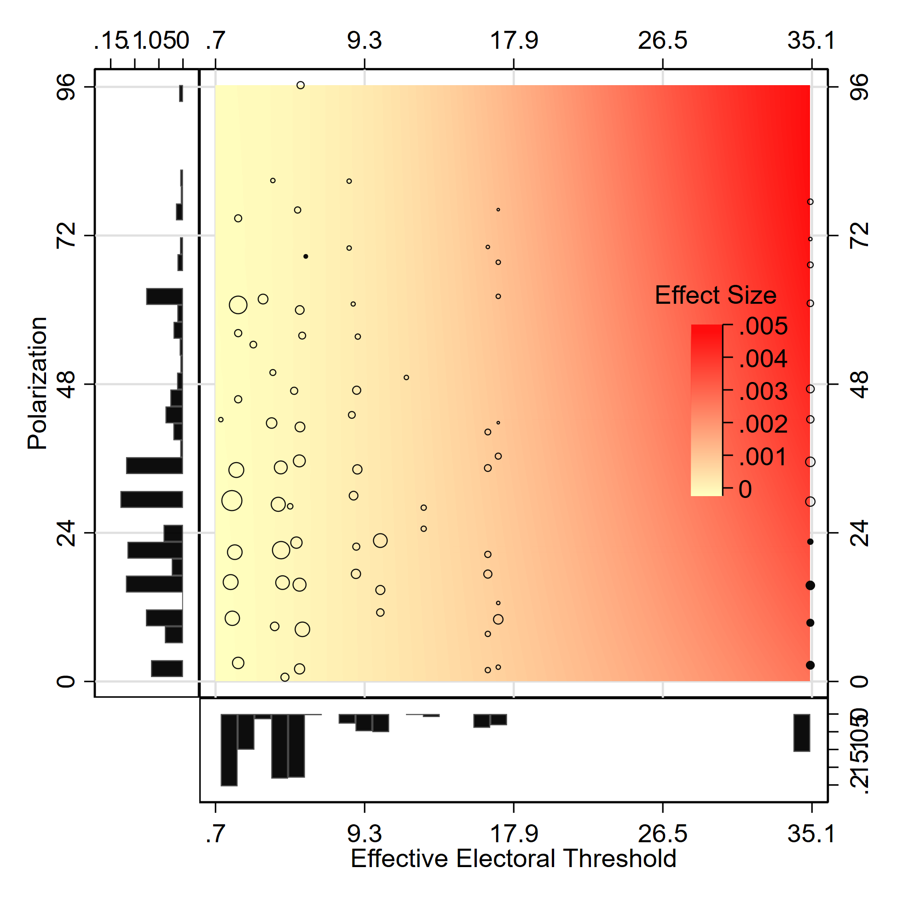
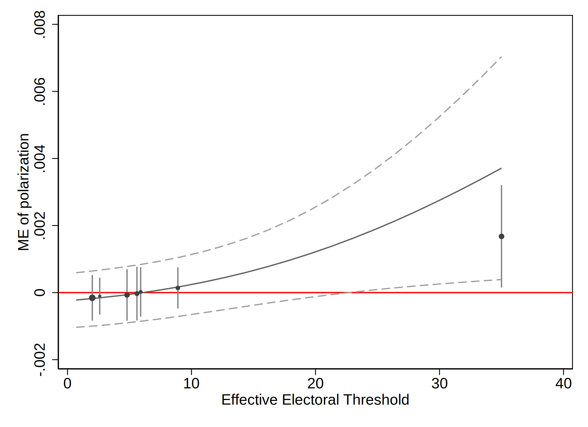
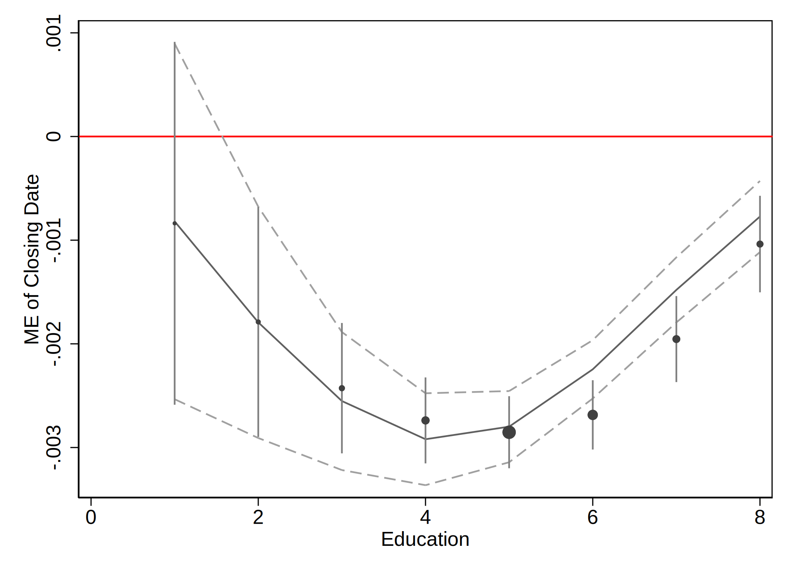
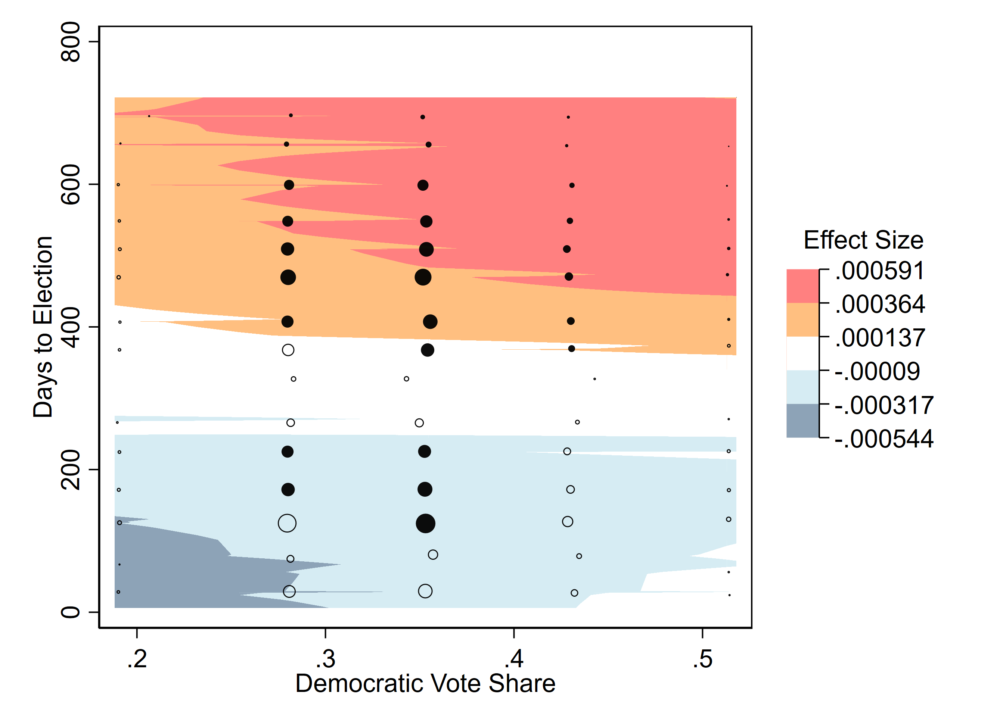
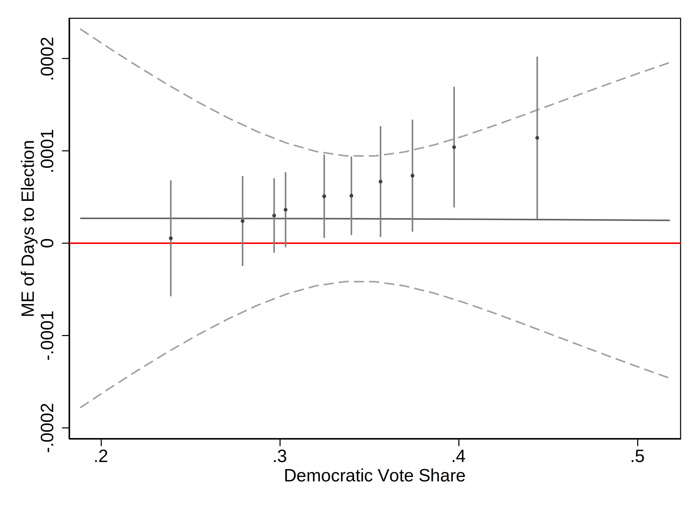

# About this document

This document shows how to generate plots with distribution-weighted
average marginal effects (DAME) and heatmaps and contour plots for the
marginal effects in Stata. We use the same examples as Zhirnov, Moral,
and Sedashov (2023), but include a simpler Stata code that relies on the
*margins* module.

# Obtaining the datasets

We will need four datasets, which are part of the replication materials
of the studies we replicate. These datasets are publicly available, and
in this section, we show how you can obtain them.

### Pre-electoral coalition formation (G)

The dataset was created by Sona Golder and used in her book (Golder
2006) on electoral alliances. It can be found on Matt Golder’s website
at
[http://mattgolder.com/files/interactions/interaction3.zip/](http://mattgolder.com/files/interactions/interaction3.zip)
under the name “interaction3.dta”.

### Voter registration rules and turnout (N)

The dataset was originally used by Nagler (1991) and made public by
William D. Berry, Jacqueline H. R. DeMeritt, and Justin Esarey as part
of the replication materials for Berry, DeMeritt, and Esarey (2010). The
file can be downloaded from
<https://jdemeritt.weebly.com/uploads/2/2/7/7/22771764/bde.zip>; it is
named as “scobit.dta”.

### News media and party discipline (AJLW)

The dataset is part of the published replication materials for Arceneaux
et al. (2016) and can be downloaded from the Harvard Dataverse
(<https://dataverse.harvard.edu/dataset.xhtml?persistentId=doi:10.7910/DVN/27597>).
We use the original, Stata version of the “FoxNews\_Master.tab” file.

### Foreign direct investment and labor protest (RT)

The dataset is part of the published replication materials for Robertson
and Teitelbaum (2011) and can be downloaded from Emmanuel Teitelbaum’s
website <https://home.gwu.edu/~ejt/pages/Data.html>, or directly from
<https://home.gwu.edu/~ejt/pages/Data_files/Robertson%20Teitelbaum%202011.dta>.

# Pre-electoral coalition formation (G)

Golder (2006) looks into the determinants of the pre-electoral coalition
formation. One of the hypotheses is that “party system polarization
increases the likelihood of pre-electoral coalitions when the electoral
system is sufficiently disproportional” (p. 87). Using a dataset of
party dyads in examined elections (G), the study estimates a model that
predicts whether a particular party dyad enters the same alliance and
includes polarization, effective electoral threshold (as a measure of
the restrictiveness of the electoral system), and their interaction term
as the predictors.

### Load the data and estimate the main model

This analysis uses a random-effects probit model with an interaction
term, which can be estimated using Stata’s default `xtprobit` command:

    clear all
    use interaction3.dta,clear

    xtprobit pec c.polarization##c.threshold c.seatshare##c.seatshare incompatibility ///
    c.asymmetry##c.seatshare, re i(ident) 

    note: seatshare omitted because of collinearity.

    Fitting comparison model:

    Iteration 0:   log likelihood = -749.41197  
    Iteration 1:   log likelihood = -683.54241  
    Iteration 2:   log likelihood = -681.29839  
    Iteration 3:   log likelihood =  -681.2926  
    Iteration 4:   log likelihood =  -681.2926  

    Fitting full model:

    rho =  0.0     log likelihood =  -681.2926
    rho =  0.1     log likelihood = -646.84249
    rho =  0.2     log likelihood = -637.69168
    rho =  0.3     log likelihood = -637.02544
    rho =  0.4     log likelihood =  -640.3162

    Iteration 0:   log likelihood = -636.85364  
    Iteration 1:   log likelihood = -626.69411  
    Iteration 2:   log likelihood = -625.68214  
    Iteration 3:   log likelihood = -625.67261  
    Iteration 4:   log likelihood = -625.67261  (backed up)

    Random-effects probit regression                     Number of obs    =  3,495
    Group variable: ident                                Number of groups =    278

    Random effects u_i ~ Gaussian                        Obs per group:
                                                                      min =      1
                                                                      avg =   12.6
                                                                      max =     55

    Integration method: mvaghermite                      Integration pts. =     12

                                                         Wald chi2(8)     =  85.48
    Log likelihood = -625.67261                          Prob > chi2      = 0.0000

    ------------------------------------------------------------------------------
             pec | Coefficient  Std. err.      z    P>|z|     [95% conf. interval]
    -------------+----------------------------------------------------------------
    polarization |   -.003196   .0054598    -0.59   0.558    -.0138971    .0075051
       threshold |   .0191695   .0108315     1.77   0.077    -.0020599    .0403989
                 |
              c. |
    polarization#|
     c.threshold |   .0005275   .0002845     1.85   0.064      -.00003    .0010851
                 |
       seatshare |    .052641   .0114296     4.61   0.000     .0302394    .0750426
                 |
     c.seatshare#|
     c.seatshare |  -.0005782   .0001095    -5.28   0.000    -.0007928   -.0003636
                 |
    incompatib~y |  -.0075775   .0025334    -2.99   0.003    -.0125428   -.0026122
       asymmetry |  -.0710249   .2988559    -0.24   0.812    -.6567716    .5147218
       seatshare |          0  (omitted)
                 |
     c.asymmetry#|
     c.seatshare |  -.0301315   .0088792    -3.39   0.001    -.0475344   -.0127286
                 |
           _cons |  -2.381516   .3134815    -7.60   0.000    -2.995928   -1.767103
    -------------+----------------------------------------------------------------
        /lnsig2u |  -.5068768     .24457                     -.9862252   -.0275283
    -------------+----------------------------------------------------------------
         sigma_u |   .7761276   .0949088                      .6107225    .9863301
             rho |    .375926   .0573775                      .2716583    .4931184
    ------------------------------------------------------------------------------
    LR test of rho=0: chibar2(01) = 111.24                 Prob >= chibar2 = 0.000

Before we can proceed to computing marginal effects, we need to trim the
dataset to keep only the used observations and save it as a file.

    keep if e(sample)
    save temp, replace

### Plotting marginal effects of polarization

At the end, we would like to have a canvas filled with colors that
reflect the estimated marginal effect of polarization for the
combinations of values of polarization and electoral threshold. To do
this, we need to

-   create a grid of equally spaced values of these variables,
-   find the marginal effects that correspond to their combinations, and
-   let Stata interpolate the values between them.

As the first step, we compute 16 equally spaced values for each of the
constitutive terms:

    use temp,clear
    foreach v of varlist polarization threshold {
        qui sum `v'
        local `v'_s "`r(min)'(`=(r(max)-r(min))/15')`r(max)'" 
    }

Local macro *polarization\_s* contains a sequence of 16 equally spaced
values from the smallest value of *polarization* to its largest value.
Local macro *threshold\_s* contains an equivalent sequence for
*threshold*. We can feed these values into a call to a *margins* routine
using the *at()* option:

    use temp,clear
    foreach v of varlist polarization threshold {
        qui sum `v'
        local `v'_s "`r(min)'(`=(r(max)-r(min))/15')`r(max)'" 
    }
    margins, dydx(polarization) at(polarization=(`polarization_s') threshold=(`threshold_s') ///
    (mean) _all) saving(temp_bg,replace)

We set all other covariates to their means. `dydx(polarization)` tells
Stata to compute the marginal effects of the predicted value of the
dependent variable with respect to *polarization*, and
`saving(temp_bg,replace)` saves the estimates as an external file
*temp\_bg.dta*.

In addition to the canvas, we want to be able to show the markers with
clusters of the values of these two variables (along with the
significance of marginal effects at those points). We can use a similar
approach to generate a 15x15 grid, bin observations within its cells,
and compute the marginal effects at the centroids of those cells. The
binning can be achieved using `egen newvar=cut(oldvar), at(numrange)`,
and the calculations of marginal effects within each cell can be done
using the `over()` option in *margins*.

    foreach v of varlist polarization threshold {
        qui sum `v' 
        egen `v'_r = cut(`v'), at(`=r(min)-0.5'(`=(1+r(max)-r(min))/15')`=r(max)+0.5')
    }
    egen group_id=group(polarization_r threshold_r)
    margins, dydx(polarization) over(group_id) at((omean) _all ///
    (mean) polarization threshold) saving(temp_me,replace)

Here we set *polarization* and *threshold* to their means for each of
the bin indicated by *group\_id*; all other variables are set to their
overall means.

We collapse the dataset in memory to determine the size and the
coordinates for the binned observations, merge in the dataset with the
estimates of the marginal effects for each of the bin (*temp\_me.dta*),
and append the dataset with the values to be used for the background
color (*temp\_bg.dta*).

    collapse (count) obs=pec (mean) polarization threshold, by(group_id)
    rename group_id _by1  /* group_id is called _by1 in the margins-generated dataset */
    merge 1:1 _by1 using temp_me, nogenerate keepusing(_margin _pvalue)
    gen significant=(_pvalue>=0.975)|(_pvalue<=0.025)
    append using temp_bg, keep(_at? _margin)
    rename _margin me_est

    /* the values of the covariates are included as _at1, _at2, _at3, etc.
      in the margins-generated dataset. The labels of these variables correspond 
      to the names of the corresponding variables in the original data */
    foreach v of varlist polarization threshold {
        foreach a of varlist _at? {
            local l: variable label `a'
            if "`l'"=="`v'" {
                replace `v'=`a' if mi(`v')
                break
            }
        }
    }

Now, use `twoway contourplot` to create a contour plot showing marginal
effects of polarization (`me_est`) on two dimensions: one showing the
values of `polarization` and another showing the values of `threshold`.
We might want to add extra observations to anchor the scatter sizes.
Additional observations 2 and 3, as defined below, will correspond to
the unplotted filled and hollow markers of the same size, equal to the
size of the largest marker of either type. Additional observations 1 and
4 correspond to the unplotted filled and hollow markers of the size
equal to that of the smallest marker of either type.

    gen counter=_n
    qui sum counter
    loc coreobs=r(max)
    set obs `=`coreobs'+4'

    qui sum obs
    replace significant=1 in `=`coreobs'+1'/`=`coreobs'+2'
    replace significant=0 in `=`coreobs'+3'/`=`coreobs'+4'
    replace obs=r(min) in `=`coreobs'+1'/`=`coreobs'+4'
    replace obs=r(max) in `=`coreobs'+2'/`=`coreobs'+3'

    /* break the ME values into steps */
    qui sum me_est 
    matrix mimx = (r(min), r(max))*(4,3,2,1,0\0,1,2,3,4)/4
    local ccuts = "`=mimx[1,2]' `=mimx[1,3]' `=mimx[1,4]'"
    local zlabs = "`=mimx[1,1]' `ccuts' `=mimx[1,5]'"

    local colr = "white*0.5 yellow*0.5 orange*0.5 red*0.5"
    /* color ramp: from less intense to more intense colors */

    twoway ///
      (contour me_est polarization threshold if !mi(me_est), ccuts(`ccuts') ccolors(`colr')) ///
      (scatter polarization threshold [fw=obs] if significant==0, ///
        msymbol(oh) mlcolor(black%95) mlwidth(vthin) msize(*.25)) /// 
      (scatter polarization threshold [fw=obs] if significant==1, ///
        msymbol(o) mfcolor(black%95) mlwidth(none) msize(*.25)), ///
      xtitle(Threshold) ytitle(Polarization) ztitle("") zlabel(`zlabs') ///
      legend(off) ///
      clegend(title("Effect Size", size(medsmall) pos(12) justification(right)) ///
                    width(5) height(25)) 

To create a heatmap instead of a contour plot, we can use the `crule`
option instead of `ccuts` in the `twoway contour` syntax.

    /* color ramp: from less intense to more intense colors */
    loc scolr="yellow*.25" /* starting color */
    loc ecolr="red*.95" /* color at the high end */

    /* Specify 5 equally spaced rounded values for labels */
    local nra = 5-1
    foreach v of varlist polarization threshold {
    qui sum `v'
    local s = (r(max)-r(min))/`nra'
    local r = 10^(floor(ln(`s')/ln(10))-1)
    local s = round(`s',`r') 
    local from = round(r(min),`r')
    local to = `from' + `nra'*`s'
    local `v'_r = "`from'(`s')`to'"
    }

    twoway (contour me_est polarization threshold if me_est!=., ///
          levels(100) crule(linear) scolor(`scolr') ecolor(`ecolr') zlab(#5, labsize(medsmall))) ///
       (scatter polarization threshold [fw=obs] if significant==0, ///
          msymbol(oh) mlcolor(black%95) mlwidth(vthin) msize(*.25)) ///
       (scatter polarization threshold [fw=obs] if significant==1, ///
          msymbol(o) mfcolor(black%95) mlwidth(none) msize(*.25)), ///
       xsca(alt) ysca(alt) xtitle("") ytitle("") ztitle("") ///
       ylab(`polarization_r', grid gmax labsize(medsmall)) ///
       xlab(`threshold_r', labsize(medsmall) grid gmax) /// 
       legend(off) clegend(title("Effect Size", size(medsmall) pos(12) justification(right)) ///
       ring(0) width(5) height(25)) name(yx, replace)

    /* to add histograms */
    twoway histogram threshold [fw=obs], frac ysca(alt reverse) ///
       xtitle("Effective Electoral Threshold", size(medsmall)) ytitle("") ///
       xlab(`threshold_r') ylab(#4, nogrid labsize(medsmall))  ///
       fysize(20) fcolor(black%95) lwidth(vthin) lcolor(white%25) nodraw name(hy, replace) 

    twoway histogram polarization [fw=obs], frac xsca(alt reverse) ///
       horiz ytitle("Polarization", size(medsmall)) xtitle("") ///
       ylab(`polarization_r') xlab(#4, nogrid labsize(medsmall)) ///
       fxsize(20) fcolor(black%95) lwidth(vthin) lcolor(white%25) nodraw name(hx, replace)

    gr combine hx yx hy, hole(3) imargin(zero) scale(1.1) xsize(5.5) ysize(5.5)

### Computing and plotting DAME of polarization

To compute DAME, we first need to break the dataset into bins according
to the values of the conditioning variable (`threshold`). We use `xtile`
to create a variable with 10 groups of observations of approximately
equal size.

    use temp,clear
    xtile group_id = threshold, nq(10)

Marginal effects within each bin are computed and averaged using
`over()` option of *margins*:

    margins, dydx(polarization) over(group_id) saving(temp_dame, replace)

To compute the marginal effects of polarization at its mean, we make a
list of 21 equally spaced values spanning from the smallest to the
largest value of `threshold` and feed it into the `at()` argument:

    qui sum threshold
    loc cuts="`=r(min)'(`=(r(max)-r(min))/20')`=r(max)'"
    margins, dydx(polarization) at(threshold=(`cuts') (mean) _all) saving(temp_mem, replace)

Collapse the dataset in memory to find the midpoints for plotting DAME
and the number of observations. Merge the dataset with DAME and append
the dataset with the marginal effects at means:

    collapse (median) threshold (count) obs=threshold, by(group_id)
    rename group_id _by1
    merge 1:1 _by1 using temp_dame, nogenerate keepusing(_margin _ci_lb _ci_ub)
    rename (_margin _ci_lb _ci_ub)(dame lb ub)
    append using temp_mem, keep(_at? _margin _ci_lb _ci_ub)
    foreach v of varlist threshold {
        foreach a of varlist _at? {
            local l: variable label `a'
            if "`l'"=="`v'" {
                replace `v'=`a' if mi(`v')
                break
            }
        }
    }
    rename (_margin _ci_lb _ci_ub)(mem lbm ubm)

Make a plot:

    twoway (line mem threshold, lpattern(solid)) ///
    (rline lbm ubm threshold, lpattern(dash)) ///
    (rspike lb ub threshold) ///
    (scatter dame threshold [fw=obs], msymbol(o) msize(*.25)), /// 
    yline(0, lcolor(red)) ytitle("ME of polarization") xtitle("Effective Electoral Threshold") ///
       legend(off)

# Voter registration rules and turnout (N)

Nagler (1991) examines the interactive effect of education and the
restrictiveness of electoral registration rules on turnout. The latter
is measured using the number of days before the election when the
registration closes (`closing`). This variable takes on the value of 0
when the voters are allowed to register on the election day, and 30
means that the registration closes 30 days before the election day. The
education is captured with an 8-category variable (`neweduc`), which is
treated as a quantitative variable. The model also includes the squared
value of `neweduc`. The main hypothesis is conditional: more restrictive
registration rules primarily hurt less educated individuals.

### Load the data and estimate the model

This expectation is captured using a probit model including the
interaction terms of `closing` and `neweduc`, and `closing` and the
squared term of education :

    clear all
    use scobit.dta,clear
    drop if newvote==-1
    probit newvote c.closing##c.neweduc##c.neweduc c.age##c.age ib(freq).south ib(freq).gov

    (0 observations deleted)

    Iteration 0:   log likelihood = -63205.249  
    Iteration 1:   log likelihood = -55865.033  
    Iteration 2:   log likelihood = -55815.316  
    Iteration 3:   log likelihood = -55815.275  
    Iteration 4:   log likelihood = -55815.275  

    Probit regression                                     Number of obs =   99,676
                                                          LR chi2(9)    = 14779.95
                                                          Prob > chi2   =   0.0000
    Log likelihood = -55815.275                           Pseudo R2     =   0.1169

    ------------------------------------------------------------------------------
         newvote | Coefficient  Std. err.      z    P>|z|     [95% conf. interval]
    -------------+----------------------------------------------------------------
         closing |   .0006238   .0037082     0.17   0.866     -.006644    .0078917
         neweduc |   .2645073    .041586     6.36   0.000     .1830003    .3460144
                 |
       c.closing#|
       c.neweduc |  -.0031723   .0014993    -2.12   0.034    -.0061108   -.0002337
                 |
       c.neweduc#|
       c.neweduc |   .0050701   .0041567     1.22   0.223    -.0030769    .0132171
                 |
       c.closing#|
       c.neweduc#|
       c.neweduc |   .0002773   .0001504     1.84   0.065    -.0000175    .0005722
                 |
             age |   .0696593   .0013051    53.37   0.000     .0671013    .0722172
                 |
     c.age#c.age |  -.0005061   .0000134   -37.71   0.000    -.0005324   -.0004798
                 |
         1.south |    -.11548   .0109736   -10.52   0.000    -.1369877   -.0939722
           1.gov |   .0034307   .0116343     0.29   0.768    -.0193722    .0262335
           _cons |  -2.743104   .1073858   -25.54   0.000    -2.953576   -2.532631
    ------------------------------------------------------------------------------

To make it easier to handle dummy variables, we explicitly declare them
factors and set its mode as the baseline category.

As earlier, we need to trim the dataset in memory to keep only the used
observations and save it as a new data file.

    keep if e(sample)
    save temp, replace

### Plotting marginal effects of voter registration rules

Find points for the background:

    ** points for the background
    foreach v of varlist closing neweduc {
        qui sum `v'
        local `v'_s "(`r(min)'(`=(r(max)-r(min))/15')`r(max)')"
    }
    margins, dydx(closing) ///
      at(closing=`closing_s' neweduc=`neweduc_s' (mean) _continuous (base) _factor) ///
      saving(temp_bg,replace)

All continuous variables (except those on the axes) are set to their
means; all factor variables are set to their baseline categories (their
modes as specified during the estimation of model parameters).

Find points for the scatterplot:

    foreach v of varlist closing neweduc {
        qui sum `v' 
        egen `v'_r = cut(`v'), at(`=r(min)-0.5'(`=(1+r(max)-r(min))/15')`=r(max)+0.5')
    }
    egen group_id=group(polarization_r threshold_r)
    margins, dydx(closing) over(group_id) ///
      at((omean) _continuous (base) _factor (mean) closing (median) neweduc) ///
      saving(temp_me,replace)

Combine information:

    collapse (count) obs=closing (mean) closing neweduc, by(group_id)

    rename group_id _by1
    merge 1:1 _by1 using temp_me, nogenerate keepusing(_margin _pvalue)
    gen significant=(_pvalue>=0.975)|(_pvalue<=0.025)
    append using temp_bg, keep(_at? _margin)
    rename _margin me_est
    foreach v of varlist closing neweduc {
        foreach a of varlist _at? {
            local l: variable label `a'
            if "`l'"=="`v'" {
                replace `v'=`a' if mi(`v')
                break
            }
        }
    }

Now, create a contour plot with the marginal effects of the registration
rules. We might want to add extra observations to anchor the sizes of
filled and hollow markers to the same largest and smallest values.

    gen counter=_n
    qui sum counter
    loc coreobs=r(max)
    set obs `=`coreobs'+4'

    qui sum obs
    replace significant=1 in `=`coreobs'+1'/`=`coreobs'+2'
    replace significant=0 in `=`coreobs'+3'/`=`coreobs'+4'
    replace obs=r(min) in `=`coreobs'+1'/`=`coreobs'+4'
    replace obs=r(max) in `=`coreobs'+2'/`=`coreobs'+3'

    /* Break the ME values into steps */
    qui sum me_est 
    matrix mimx = (r(min), r(max))*(4,3,2,1,0\0,1,2,3,4)/4
    local ccuts = "`=mimx[1,2]' `=mimx[1,3]' `=mimx[1,4]'"
    local zlabs = "`=mimx[1,1]' `ccuts' `=mimx[1,5]'"

    local colr = "red*.5 orange*.5 yellow*.5 white*.5" 
    /* Color ramp from more intense to less intense colors */

    /* Note that the replication do file uses additional graphical parameters, 
    which leads to different axis and legend labels from this minimal example. */
    twoway (contour me_est closing neweduc if !mi(me_est), ///
      ccuts(`ccuts') ccolors(`colr')) ///
    (scatter closing neweduc [fw=obs] if significant==0, ///
      msymbol(oh) mlcolor(black%95) mlwidth(vthin) msize(*.25)) /// 
    (scatter closing neweduc [fw=obs] if significant==1, ///
      msymbol(o) mfcolor(black%95) mlwidth(none) msize(*.25)), ///
    xtitle(Education) ytitle(Closing Date) ztitle("") zlabel(`zlabs') ///
      legend(off)  clegend(title("Effect Size", ///
      size(medsmall) pos(12) justification(right)) width(5) height(25)) 

### Computing and plotting DAME of the restrictiveness of electoral registration rules

Find average effects by group:

    use temp,clear
    gen group_id = round(neweduc)
    margins, dydx(closing) over(group_id) saving(temp_dame, replace) 

Find marginal effects at means: set the factor variables to their
baseline categories (modes) and all continuous variables (except those
undere consideration) to their means.

    use temp,clear
    qui sum neweduc
    loc cuts="`=r(min)'(1)`=r(max)'"
    margins, dydx(closing) at(neweduc=(`cuts') (mean) _continuous (base) _factor) ///
       saving(temp_mem, replace)

Collapse the dataset in memory, combine information:

    collapse (median) neweduc (count) obs=neweduc, by(group_id)
    rename group_id _by1
    merge 1:1 _by1 using temp_dame, nogenerate keepusing(_margin _ci_lb _ci_ub)
    rename (_margin _ci_lb _ci_ub)(dame lb ub)
    append using temp_mem, keep(_at? _margin _ci_lb _ci_ub)
    foreach v of varlist neweduc {
        foreach a of varlist _at? {
            local l: variable label `a'
            if "`l'"=="`v'" {
                replace `v'=`a' if mi(`v')
                break
            }
        }
    }
    rename (_margin _ci_lb _ci_ub)(mem lbm ubm)

Produce a plot:

    twoway (line mem neweduc, lpattern(solid)) ///
    (rline lbm ubm neweduc, lpattern(dash)) ///
    (rspike lb ub neweduc) ///
    (scatter dame neweduc [fw=obs], msymbol(o) msize(*.25)), /// 
    yline(0, lcolor(red)) ytitle("ME of Closing Date") xtitle("Education") legend(off) 

# News media and party discipline (AJLW)

Arceneaux et al. (2016) view Congressmen as facing a choice between
voting with the party and more closely following the preferences of
their constituencies. Politicians are expected to vote with their party
when they can afford to do so when the next election is sufficiently
far, their district is safe, or they can shape the public opinion in
their districts. The article presents several hypotheses about the
interactive effects of these factors, but in the interest of space, we
focus here only on the interaction between competitiveness and the
proximity of elections.

### Load the data and estimate the model

To examine the interactive effect of district competitiveness and the
proximity of the next election, following Arceneaux et al. (2016), we
subset the data and examine the Republicans from the districts in which
Fox News was present (this is another explanatory variable in the
authors’ study) and build a model explaining whether a Congressman voted
with their party and including a full interaction term of the polynomial
of the number of days until the next election and the Democratic vote
share in the preceding election in the representative’s district (the
larger this share, the more competitive the district). Before
estimation, to make interpretation easier, we combine dummy variables
for the type of the vote into a single variable with multiple
categories. We designate the modes as the baseline levels for the
respective factor variables.

    clear all
    use "FoxNews_Master.dta",clear
    gen dvprop=dv/100
    gen vtype_char = "OtherProc" if !mi(RegPass)
    foreach v of varlist RegPass Amend OtherPass ProPart Susp {
        replace vtype_char="`v'" if `v'
    }
    encode vtype_char,gen(votetype)

    logit PartyVote c.daystoelection##c.daystoelection##c.daystoelection##c.dvprop seniorit ///
      spendgap_lag spendgap distpart_lag ib(freq).votetype ib(freq).Retirement ///
      ib(freq).qualchal_lag ib(freq).qualchal ///
      if PresencePartyUnity==1 & Republican==1 & FoxNews==1, cluster(dist2)

    (2,080 missing values generated)

    (68,326 real changes made)
    (140,176 real changes made)
    (44,820 real changes made)
    (77,180 real changes made)
    (60,427 real changes made)

    Iteration 0:   log pseudolikelihood = -21866.053  
    Iteration 1:   log pseudolikelihood = -19635.905  
    Iteration 2:   log pseudolikelihood = -19349.274  
    Iteration 3:   log pseudolikelihood = -19345.854  
    Iteration 4:   log pseudolikelihood = -19345.849  
    Iteration 5:   log pseudolikelihood = -19345.849  

    Logistic regression                                     Number of obs = 57,086
                                                            Wald chi2(18) =      .
                                                            Prob > chi2   =      .
    Log pseudolikelihood = -19345.849                       Pseudo R2     = 0.1153

                                     (Std. err. adjusted for 73 clusters in dist2)
    ------------------------------------------------------------------------------
                 |               Robust
       PartyVote | Coefficient  std. err.      z    P>|z|     [95% conf. interval]
    -------------+----------------------------------------------------------------
    daystoelec~n |  -.0053586    .006298    -0.85   0.395    -.0177025    .0069852
                 |
              c. |
    daystoelec~n#|
              c. |
    daystoelec~n |   .0000157   .0000199     0.79   0.430    -.0000233    .0000548
                 |
              c. |
    daystoelec~n#|
              c. |
    daystoelec~n#|
              c. |
    daystoelec~n |  -1.50e-08   1.92e-08    -0.78   0.435    -5.27e-08    2.27e-08
                 |
          dvprop |    .998585   2.279037     0.44   0.661    -3.468246    5.465416
                 |
              c. |
    daystoelec~n#|
        c.dvprop |   .0110505   .0181061     0.61   0.542    -.0244367    .0465377
                 |
              c. |
    daystoelec~n#|
              c. |
    daystoelec~n#|
        c.dvprop |  -.0000448   .0000578    -0.77   0.439     -.000158    .0000685
                 |
              c. |
    daystoelec~n#|
              c. |
    daystoelec~n#|
              c. |
    daystoelec~n#|
        c.dvprop |   5.76e-08   5.64e-08     1.02   0.307    -5.30e-08    1.68e-07
                 |
        seniorit |  -.0340132   .0238695    -1.42   0.154    -.0807966    .0127702
    spendgap_lag |   .0166931   .0408697     0.41   0.683      -.06341    .0967961
        spendgap |  -.0477062   .0422487    -1.13   0.259    -.1305121    .0350996
    distpart_lag |   6.657421   1.367335     4.87   0.000     3.977493    9.337348
                 |
        votetype |
      OtherPass  |   1.261922   .0825187    15.29   0.000     1.100188    1.423656
      OtherProc  |    2.20396   .0958879    22.98   0.000     2.016023    2.391897
        ProPart  |    1.98483   .0515924    38.47   0.000     1.883711    2.085949
        RegPass  |   .9757746   .0730834    13.35   0.000     .8325338    1.119015
           Susp  |   1.159763   .1306688     8.88   0.000     .9036568    1.415869
                 |
    1.Retirement |   1.015441   .1738517     5.84   0.000     .6746975    1.356184
    1.qualchal~g |   .2339622    .175486     1.33   0.182    -.1099841    .5779085
      1.qualchal |  -.1627822   .1762658    -0.92   0.356    -.5082568    .1826924
           _cons |  -2.277705   1.202385    -1.89   0.058    -4.634337    .0789273
    ------------------------------------------------------------------------------

As earlier, we need to trim the dataset in Stata’s memory to keep only
the observations in the estimation sample and save it as a new data
file.

    keep if e(sample)
    save temp, replace

### Plotting marginal effects of election proximity

Find points for the backgound. All continuous variables (except the main
ones) are set to their means, and all factor variables are set to their
baseline categories.

    foreach v of varlist daystoelection dvprop {
        qui sum `v'
        local `v'_s "(`r(min)'(`=(r(max)-r(min))/15')`r(max)')"
    }
    margins, dydx(daystoelection) at(daystoelection=`daystoelection_s' dvprop=`dvprop_s' ///
      (mean) _continuous (base) _factor) saving(temp_bg,replace)

Find points for the foreground. All continuous variables (except the
main ones) are set to their global means, and all factor variables are
set to their baseline categories. The variables under consideration are
set to their means within groups.

    foreach v of varlist daystoelection dvprop {
        qui sum `v' 
        egen `v'_r = cut(`v'), at(`=r(min)-0.5'(`=(1+r(max)-r(min))/15')`=r(max)+0.5')
    }
    egen group_id=group(daystoelection_r dvprop_r)
    margins, dydx(daystoelection) over(group_id) at((omean) _continuous ///
      (base) _factor (mean) daystoelection dvprop) saving(temp_me,replace)

Combine information

    collapse (count) obs=daystoelection (mean) daystoelection dvprop, by(group_id)

    rename group_id _by1
    merge 1:1 _by1 using temp_me, nogenerate keepusing(_margin _pvalue)
    gen significant=(_pvalue>=0.975)|(_pvalue<=0.025)
    append using temp_bg, keep(_at? _margin)
    rename _margin me_est
    foreach v of varlist daystoelection dvprop {
        foreach a of varlist _at? {
            local l: variable label `a'
            if "`l'"=="`v'" {
                replace `v'=`a' if mi(`v')
                break
            }
        }
    }

Now, create a contourplot. We might want to add extra observations to
anchor the sizes of filled and hollow markers to a common scale. It is
advisable to specify the color ramp in a way that more intense colors
represent negative and positive values of higher magnitude.

    gen counter=_n
    qui sum counter
    loc coreobs=r(max)
    set obs `=`coreobs'+4'

    qui sum obs
    replace significant=1 in `=`coreobs'+1'/`=`coreobs'+2'
    replace significant=0 in `=`coreobs'+3'/`=`coreobs'+4'
    replace obs=r(min) in `=`coreobs'+1'/`=`coreobs'+4'
    replace obs=r(max) in `=`coreobs'+2'/`=`coreobs'+3'

    * Break the ME values into steps
    qui sum me_est 
    matrix mimx = (r(min), r(max))*(5,4,3,2,1,0\0,1,2,3,4,5)/5
    local ccuts = "`=mimx[1,2]' `=mimx[1,3]' `=mimx[1,4]' `=mimx[1,5]'"
    local zlabs = "`=mimx[1,1]' `ccuts' `=mimx[1,6]'"

    loc colr= "navy*.5 ltblue*.5 white*.5 orange*.5 red*.5"
    /* Color ramp has intense colors at both ends */

    /* Note that the replication do file uses additional graphical parameters, 
       which leads to different axis and legend labels from this minimal example. */
    twoway (contour me_est daystoelection dvprop if me_est!=., ccuts(`ccuts') ccolors(`colr')) ///
    (scatter daystoelection dvprop [fw=obs] if significant==0, ///
       msymbol(oh) mlcolor(black%95) mlwidth(vthin) msize(*.25)) /// 
    (scatter daystoelection dvprop [fw=obs] if significant==1, ///
       msymbol(o) mfcolor(black%95) mlwidth(none) msize(*.25)), ///
    xtitle(Democratic Vote Share) ytitle(Days to Election) ///
      ztitle("") zlabel(`zlabs') ///
      legend(off) ///
      clegend(title(`"Effect Size"', size(medsmall) pos(12) justification(right)) width(5) height(25)) 

### Computing and plotting DAME of election proximity

To compute the distribution-weighted average marginal effects, we first
need to break the dataset into bins according to the values of the
conditioning variable (the Democratic vote share, `dvprop`). Here, we
use deciles:

    use temp,clear
    xtile group_id = dvprop, nq(10)
    margins, dydx(daystoelection) over(group_id) vce(unconditional) saving(temp_dame, replace)

Compute the marginal effect of the proximity of the next election at its
mean, 21 equally-spaced values of the Democratic vote share, and the
means or modes of all other covariates:

    qui sum dvprop
    loc cuts="`=r(min)'(`=(r(max)-r(min))/20')`=r(max)'"
    margins, dydx(daystoelection) at(dvprop=(`cuts') (mean) _continuous (base) _factor) ///
      vce(unconditional) saving(temp_mem, replace)

Combine data:

    collapse (median) dvprop (count) obs=dvprop, by(group_id)
    rename group_id _by1
    merge 1:1 _by1 using temp_dame, nogenerate keepusing(_margin _ci_lb _ci_ub)
    rename (_margin _ci_lb _ci_ub)(dame lb ub)
    append using temp_mem, keep(_at? _margin _ci_lb _ci_ub)
    foreach v of varlist dvprop {
        foreach a of varlist _at? {
            local l: variable label `a'
            if "`l'"=="`v'" {
                replace `v'=`a' if mi(`v')
                break
            }
        }
    }
    rename (_margin _ci_lb _ci_ub)(mem lbm ubm)

Produce a plot:

    twoway (line mem dvprop, lpattern(solid)) ///
    (rline lbm ubm dvprop, lpattern(dash)) ///
    (rspike lb ub dvprop) ///
    (scatter dame dvprop [fw=obs], msymbol(o) msize(*.25)), /// 
    yline(0, lcolor(red)) ytitle("ME of Days to Election") xtitle("Democratic Vote Share") ///
      legend(off)

# Foreign direct investment and labor protest (RT)

Robertson and Teitelbaum (2011) study the response of the local labor to
foreign direct investment. The article argues that FDI flows lead to
more labor protests, and this effect is more substantial when there are
fewer democratic means for resolving such conflicts.

### Load the data and estimate the model

Since the dependent variable is a count of protests, we use a negative
binomial regression. Because Stata (with random effects, as in the
original study). The right-hand side of the model equation includes an
interaction of political regime (Polity 2 score) and the natural log of
FDI flows: the latter’s effect is expected to be conditional on the
values of the former. Both variables are lagged.

    clear all
    use "Robertson Teitelbaum 2011.dta",clear

    tsset country year 
    gen l_l_flows=L.l_flows
    gen l_polity2=L.polity2
    gen l_dispute=L.dispute
    gen l_demflows=l_l_flows*l_polity2
     
    nbreg dispute c.l_l_flows##c.l_polity2 l_dispute open_penn l_gdp_pc_penn gdp_grth ///
      inflation_1 urban xratchg l_pop time
    keep if e(sample)

    Panel variable: country (strongly balanced)
     Time variable: year, 1979 to 2006
             Delta: 1 unit

    (882 missing values generated)

    (635 missing values generated)

    (138 missing values generated)

    (1,074 missing values generated)

    Fitting Poisson model:

    Iteration 0:   log likelihood = -19743.067  (not concave)
    Iteration 1:   log likelihood = -19693.709  (not concave)
    Iteration 2:   log likelihood = -19669.166  (not concave)
    Iteration 3:   log likelihood = -19419.284  (not concave)
    Iteration 4:   log likelihood = -13856.193  (not concave)
    Iteration 5:   log likelihood = -11966.287  (not concave)
    Iteration 6:   log likelihood = -11310.599  (not concave)
    Iteration 7:   log likelihood = -10199.071  
    Iteration 8:   log likelihood = -9186.4985  (backed up)
    Iteration 9:   log likelihood = -6216.4714  (backed up)
    Iteration 10:  log likelihood = -3115.8101  (backed up)
    Iteration 11:  log likelihood = -2711.2173  
    Iteration 12:  log likelihood = -1142.8628  
    Iteration 13:  log likelihood = -1049.5449  
    Iteration 14:  log likelihood = -994.70282  
    Iteration 15:  log likelihood = -994.26758  
    Iteration 16:  log likelihood = -994.26733  
    Iteration 17:  log likelihood = -994.26733  

    Fitting constant-only model:

    Iteration 0:   log likelihood = -1388.1254  (not concave)
    Iteration 1:   log likelihood = -1052.3141  
    Iteration 2:   log likelihood = -1043.1756  
    Iteration 3:   log likelihood = -1043.1752  
    Iteration 4:   log likelihood = -1043.1752  

    Fitting full model:

    Iteration 0:   log likelihood = -987.94406  (not concave)
    Iteration 1:   log likelihood = -857.95872  
    Iteration 2:   log likelihood = -826.58029  
    Iteration 3:   log likelihood = -798.29417  
    Iteration 4:   log likelihood =  -789.9797  
    Iteration 5:   log likelihood = -789.58114  
    Iteration 6:   log likelihood = -789.57898  
    Iteration 7:   log likelihood = -789.57898  

    Negative binomial regression                            Number of obs =  2,348
                                                            LR chi2(12)   = 507.19
    Dispersion: mean                                        Prob > chi2   = 0.0000
    Log likelihood = -789.57898                             Pseudo R2     = 0.2431

    ------------------------------------------------------------------------------
         dispute | Coefficient  Std. err.      z    P>|z|     [95% conf. interval]
    -------------+----------------------------------------------------------------
       l_l_flows |   .1508375   .0630615     2.39   0.017     .0272392    .2744358
       l_polity2 |   .1871974   .0419696     4.46   0.000     .1049386    .2694563
                 |
     c.l_l_flows#|
     c.l_polity2 |  -.0194819   .0064384    -3.03   0.002     -.032101   -.0068629
                 |
       l_dispute |   .3391093     .05058     6.70   0.000     .2399744    .4382442
       open_penn |  -.0005637   .0020886    -0.27   0.787    -.0046572    .0035298
    l_gdp_pc_p~n |   .2981196   .1761671     1.69   0.091    -.0471616    .6434008
        gdp_grth |  -.0004039   .0181047    -0.02   0.982    -.0358885    .0350807
     inflation_1 |   .0000981   .0000848     1.16   0.247    -.0000681    .0002644
           urban |   .0226707   .0063548     3.57   0.000     .0102155    .0351259
         xratchg |  -.0007718   .0046886    -0.16   0.869    -.0099613    .0084176
           l_pop |   .6341396   .0793996     7.99   0.000     .4785192      .78976
            time |   -.011712   .0147303    -0.80   0.427     -.040583    .0171589
           _cons |  -17.23651   1.921069    -8.97   0.000    -21.00174   -13.47129
    -------------+----------------------------------------------------------------
        /lnalpha |   .9170054    .140736                      .6411678    1.192843
    -------------+----------------------------------------------------------------
           alpha |   2.501787   .3520916                      1.898697    3.296439
    ------------------------------------------------------------------------------
    LR test of alpha=0: chibar2(01) = 409.38               Prob >= chibar2 = 0.000

    (1,516 observations deleted)

As earlier, we need to trim the dataset in memory to keep only the
observations in the estimation sample and save it as a new data file.

    keep if e(sample)
    save temp, replace

### Plotting marginal effects of logged FDI flows

First, we calculate marginal effects for the heatmap. By default, if
called after `xtnbreg,re`, *margins* computes marginal effects on the
linear prediction; to compute marginal effects on the incidence rate, we
need include `predict(ir0)` option. This specification ignores random
effects.

    foreach v of varlist l_l_flows l_polity2 {
        qui sum `v'
        local `v'_s "(`r(min)'(`=(r(max)-r(min))/15')`r(max)')"
    }
    margins, dydx(l_l_flows) at(l_l_flows=`l_l_flows_s' l_polity2=`l_polity2_s' (mean) _all) ///
     predict(iru0) saving(temp_bg,replace)

We bin the values of logged flows to avoid overplotting later on.

    foreach v of varlist l_l_flows l_polity2 {
        qui sum `v' 
        egen `v'_r = cut(`v'), at(`=r(min)-0.5'(`=(1+r(max)-r(min))/10')`=r(max)+0.5')
    }
    egen group_id=group(l_l_flows_r l_polity2_r)
    margins, dydx(l_l_flows) over(group_id) at((omean) _all (mean) l_l_flows l_polity2) ///
      predict(iru0) saving(temp_me,replace)

Combine information:

    collapse (count) obs=l_l_flows (mean) l_l_flows l_polity2, by(group_id)

    rename group_id _by1
    merge 1:1 _by1 using temp_me, nogenerate keepusing(_margin _pvalue)
    gen significant=(_pvalue>=0.975)|(_pvalue<=0.025)
    append using temp_bg, keep(_at? _margin)
    rename _margin me_est
    foreach v of varlist l_l_flows l_polity2 {
        foreach a of varlist _at? {
            local l: variable label `a'
            if "`l'"=="`v'" {
                replace `v'=`a' if mi(`v')
                break
            }
        }
    }
     

Now, create a heatmap. We might want to add extra observations to anchor
the marker sizes on the scatter plot.

    gen counter=_n
    qui sum counter
    loc coreobs=r(max)
    set obs `=`coreobs'+4'

    qui sum obs
    replace significant=1 in `=`coreobs'+1'/`=`coreobs'+2'
    replace significant=0 in `=`coreobs'+3'/`=`coreobs'+4'
    replace obs=r(min) in `=`coreobs'+1'/`=`coreobs'+4'
    replace obs=r(max) in `=`coreobs'+2'/`=`coreobs'+3'

    * Color ramp from less intense to more intense colors
    loc scolr="yellow*.25"
    loc ecolr="red*.95"

    * Labs: numlist specification for 5 equally spaced values for each variable
    local nra = 5-1
    foreach v of varlist l_l_flows l_polity2 {
    qui sum `v'
    local s = (r(max)-r(min))/`nra'
    local r = 10^(floor(ln(`s')/ln(10))-1)
    local s = round(`s',`r') 
    local from = round(r(min),`r')
    local to = `from' + `nra'*`s'
    local `v'_r = "`from'(`s')`to'"
    } 

    /* Note that the replication do file uses additional graphical parameters, 
       which leads to different axis and legend labels from this minimal example. */
    twoway (contour me_est l_l_flows l_polity2 if me_est!=., levels(100) crule(linear) ///
       scolor(`scolr') ecolor(`ecolr') zlab(#5, labsize(medsmall))) ///
    (scatter l_l_flows l_polity2 [fw=obs] if significant==0, ///
       msymbol(oh) mlcolor(black%95) mlwidth(vthin) msize(*.25)) ///
    (scatter l_l_flows l_polity2 [fw=obs] if significant==1, ///
       msymbol(o) mfcolor(black%95) mlwidth(none) msize(*.25)), ///
    xsca(alt) ysca(alt) xtitle("") ytitle("") ztitle("") ///
    ylab(`l_l_flows_r', grid gmax labsize(medsmall)) ///
    xlab(`l_polity2_r', labsize(medsmall) grid gmax) /// 
    clegend(title("Effect Size", size(medsmall) pos(12) justification(right)) ring(0) ///
       width(5) height(25)) ///
    legend(off) nodraw name(yx, replace)

    twoway histogram l_polity2 [fw=obs], frac ysca(alt reverse) ///
    xtitle("Polity 2", size(medsmall)) ytitle("") ///
    xlab(`l_polity2_r') ylab(#4, nogrid labsize(medsmall)) ///
    fysize(20) fcolor(black%95) lwidth(vthin) lcolor(white%25) nodraw name(hy, replace) 

    twoway histogram l_l_flows [fw=obs], frac xsca(alt reverse) horiz ytitle("ln(FDI flows)", ///
              size(medsmall)) xtitle("") ///
    ylab(`l_l_flows_r', grid gmax labsize(medsmall)) xlab(#4, nogrid labsize(medsmall))  ///
    fxsize(20) fcolor(black%95) lwidth(vthin) lcolor(white%25) nodraw name(hx, replace)

    gr combine hx yx hy, hole(3) imargin(zero) scale(1.1) xsize(5.5) ysize(5.5)

### Computing and plotting DAME of the logged FDI flows:

To compute the distribution-weighted average marginal effects, we first
need to break the dataset into 4 bins based on the values of the
conditioning variable:

    use temp,clear
    xtile group_id = l_polity2, nq(4)
    margins, dydx(l_l_flows) over(group_id) predict(iru0) saving(temp_dame, replace) 

Compute the marginal effect of `l_l_flows` at its mean:

    qui sum l_polity2
    loc cuts="`=r(min)'(1)`=r(max)'"
    margins, dydx(l_l_flows) at(l_polity2=(`cuts')) atmeans predict(iru0) saving(temp_mem, replace)

Combine information:

    collapse (median) l_polity2 (count) obs=l_polity2, by(group_id)
    rename group_id _by1
    merge 1:1 _by1 using temp_dame, nogenerate keepusing(_margin _ci_lb _ci_ub)
    rename (_margin _ci_lb _ci_ub)(dame lb ub)
    append using temp_mem, keep(_at? _margin _ci_lb _ci_ub) 
    foreach v of varlist l_polity2 {
        foreach a of varlist _at? {
            local l: variable label `a'
            if "`l'"=="`v'" {
                replace `v'=`a' if mi(`v')
                break
            }
        }
    }
    rename (_margin _ci_lb _ci_ub)(mem lbm ubm)

Produce a plot:

    twoway (line mem l_polity2, lpattern(solid)) ///
    (rline lbm ubm l_polity2, lpattern(dash)) ///
    (rspike lb ub l_polity2) ///
    (scatter dame l_polity2 [fw=obs], msymbol(o) msize(*.25)), /// 
    yline(0, lcolor(red)) ytitle("ME of ln(FDI flows)") xtitle("Polity 2") legend(off)

# This document

This document was produced with RMarkdown Xie (2021), Hemken (2021)
using Stata 17.0 and R version 4.1.0.

# References

Allaire, JJ, Yihui Xie, Jonathan McPherson, Javier Luraschi, Kevin
Ushey, Aron Atkins, Hadley Wickham, Joe Cheng, Winston Chang, and
Richard Iannone. 2021. *Rmarkdown: Dynamic Documents for r*.
<https://github.com/rstudio/rmarkdown>.

Arceneaux, Kevin, Martin Johnson, Rene Lindstädt, and Ryan J. Vander
Wielen. 2016. “The Influence of News Media on Political Elites:
Investigating Strategic Responsiveness in Congress.” *American Journal
of Political Science* 60 (1): 5–29.

Berry, William, Jacqueline DeMeritt, and Justin Esarey. 2010. “Testing
for Interaction in Binary Logit and Probit Models: Is a Product Term
Essential?” *American Journal of Political Science* 54 (1): 248–66.

Golder, Sona. 2006. *The Logic of Pre-Electoral Coalition Formation*.
Columbus: Ohio State University Press.

Hemken, Doug. 2021. *Statamarkdown: ’Stata’ Markdown*.

Nagler, Jonathan. 1991. “The Effect of Registration Laws and Education
on u.s. Voter Turnout.” *American Political Science Review* 85 (4):
1393–1405.

Robertson, Graeme B., and Emmanuel Teitelbaum. 2011. “Foreign Direct
Investment, Regime Type, and Labor Protest in Developing Countries.”
*American Journal of Political Science* 55 (3): 665–77.

Xie, Yihui. 2021. *Knitr: A General-Purpose Package for Dynamic Report
Generation in r*. <https://yihui.org/knitr/>.

Zhirnov, Andrei, Mert Moral, and Evgeny Sedashov. 2023. “Taking
Distributions Seriously: On the Interpretation of the Estimates of
Interactive Nonlinear Models.” *Political Analysis* 31 (2): 213–34.
