# Required packages

This document illustrates how one can use the `DAME` package to
replicate the calculations presented in Zhirnov, Moral, and Sedashov
(2022). The current version of the `DAME` package can be installed from
GitHub using `devtools::install_github`:

    library(devtools)
    install_github("andreizhirnov/DAME") 
    library(DAME)

The version of this package used to generate this document can be
installed using its v1.0.0 release:

    install_github("andreizhirnov/DAME@v1.0.0") 

`DAME` depends on `stats` (R Core Team 2021), `methods` (R Core Team
2021), and `MASS` (Ripley 2021) for calculations, and `ggplot2` (Wickham
et al. 2021) for plotting.

In this document, we also refer to the `foreign` (R Core Team 2020) and
`dataverse` (Kuriwaki et al. 2021) packages to download the
below-mentioned datasets, `glmmTMB` (Magnusson et al. 2021) to estimate
multi-level models, `sandwich` (Zeileis and Lumley 2021) to compute
robust variance-covariance matrices, and `ggExtra` (Attali and Baker
2019) to add histograms to heatmaps and contour-plots.

# Obtaining the datasets

We will need four datasets, which are included in the replication
materials of the studies we replicated. These datasets are publicly
available, and in this section, we show how you can obtain them.

### Pre-electoral coalition formation (G)

The dataset was created by Sona Golder and used in her book (Golder
2006) on electoral alliances. It can be found on Matt Golder’s web-page
at <http://mattgolder.com/files/interactions/>. The following script can
be used to download it using R:

    library(foreign)
    tmpdir <- tempdir()
    download.file(url="http://mattgolder.com/files/interactions/interaction3.zip", 
                  file.path(tmpdir, "interaction3.zip"))
    unzip(file.path(tmpdir, "interaction3.zip"), exdir = tmpdir )
    dataset <- read.dta(file.path(tmpdir,"interaction3.dta"))
    saveRDS(dataset, "G.rds")

### Voter registration rules and turnout (N)

The dataset was originally used by Nagler (1991). It was made public by
William D. Berry, Jacqueline H. R. DeMeritt, and Justin Esarey as part
of the replication materials for Berry, DeMeritt, and Esarey (2010). The
following script can be used to download it using R:

    library(foreign)
    tmpdir <- tempdir()
    download.file(url="https://jdemeritt.weebly.com/uploads/2/2/7/7/22771764/bde.zip", 
                  file.path(tmpdir, "bde.zip"))
    unzip(file.path(tmpdir, "bde.zip"), exdir = tmpdir )
    dataset <- read.dta(file.path(tmpdir,"scobit.dta"))
    saveRDS(dataset, "N.rds")

### News media and party discipline (AJLW)

The datasets is part of the published replication materials for
Arceneaux et al. (2016) and can be downloaded either directly from the
Harvard Dataverse
<https://dataverse.harvard.edu/dataset.xhtml?persistentId=doi:10.7910/DVN/27597>
or using the `dataverse` package:

    library(dataverse)
    dataset <- get_dataframe_by_name(filename = "FoxNews_Master.tab", 
                                     dataset="doi:10.7910/DVN/27597",
                                     server="dataverse.harvard.edu",
                                     original = TRUE,
                                     .f=  foreign::read.dta)
    saveRDS(dataset, "AJLW.rds")

### Foreign direct investment and labor protest (RT)

The datasets is part of the published replication materials for
Robertson and Teitelbaum (2011) and can be downloaded from Emmanuel
Teitelbaum’s website: <https://home.gwu.edu/~ejt/pages/Data.html>. The
following script can be used to download it using R:

    library(foreign)
    dataset <- 
      read.dta("https://home.gwu.edu/~ejt/pages/Data_files/Robertson%20Teitelbaum%202011.dta")
    saveRDS(dataset,"RT.rds")

# Pre-electoral coalition formation (G)

Golder (2006) looks into the determinants of the pre-electoral coalition
formation. One of the hypotheses is that “party system polarization
increases the likelihood of pre-electoral coalitions when the electoral
system is sufficiently disproportional” (p. 87). Using a dataset of
party dyads in examined elections (G), the study estimates a model that
predicts whether a particular party dyad enters the same alliance and
includes polarization, effective electoral threshold (as a measure of
the restrictiveness of the electoral system), and their interaction term
as the predictors.

### Estimate the main model

The probit model with an interaction term can be estimated using
`stats::glm()` function:

    dt <- readRDS("G.rds")
    dt <- subset(dt, complete.cases(dt[c("pec","polarization","threshold","seatshare",
                                         "incompatibility","asymmetry")]))
    m <- glm(pec ~ polarization*threshold + seatshare + I(seatshare^2) + incompatibility + 
               asymmetry + asymmetry:seatshare, data=dt, family=binomial(link="probit"))
    summary(m)

    ## 
    ## Call:
    ## glm(formula = pec ~ polarization * threshold + seatshare + I(seatshare^2) + 
    ##     incompatibility + asymmetry + asymmetry:seatshare, family = binomial(link = "probit"), 
    ##     data = dt)
    ## 
    ## Deviance Residuals: 
    ##     Min       1Q   Median       3Q      Max  
    ## -1.1265  -0.3457  -0.2690  -0.2150   2.9468  
    ## 
    ## Coefficients:
    ##                          Estimate Std. Error z value Pr(>|z|)    
    ## (Intercept)            -2.1005362  0.2040356 -10.295  < 2e-16 ***
    ## polarization           -0.0014849  0.0026606  -0.558 0.576757    
    ## threshold               0.0206984  0.0060720   3.409 0.000652 ***
    ## seatshare               0.0430151  0.0085270   5.045 4.55e-07 ***
    ## I(seatshare^2)         -0.0004475  0.0000825  -5.425 5.81e-08 ***
    ## incompatibility        -0.0053749  0.0020063  -2.679 0.007382 ** 
    ## asymmetry               0.0208886  0.2356696   0.089 0.929372    
    ## polarization:threshold  0.0002361  0.0001449   1.629 0.103225    
    ## seatshare:asymmetry    -0.0244723  0.0068860  -3.554 0.000380 ***
    ## ---
    ## Signif. codes:  0 '***' 0.001 '**' 0.01 '*' 0.05 '.' 0.1 ' ' 1
    ## 
    ## (Dispersion parameter for binomial family taken to be 1)
    ## 
    ##     Null deviance: 1464.6  on 3494  degrees of freedom
    ## Residual deviance: 1341.4  on 3486  degrees of freedom
    ## AIC: 1359.4
    ## 
    ## Number of Fisher Scoring iterations: 6

To replicate the original analysis, this model needs to include
party-specific random effects. We can include those using `glmmTMB()`
function from the `glmmTMB` package. You could achieve very similar
results with `lme4`, which, however, has more limited functionality and
is a bit slower than `glmmTMB` for estimating the models we show in this
document.

    library(glmmTMB) 
    m2 <- glmmTMB(pec ~ polarization*threshold + seatshare + I(seatshare^2) + incompatibility + 
                    asymmetry + asymmetry:seatshare + (1|ident), 
                      data=dt, 
                      family=binomial(link="probit"))

    summary(m2)

    ##  Family: binomial  ( probit )
    ## Formula:          
    ## pec ~ polarization * threshold + seatshare + I(seatshare^2) +  
    ##     incompatibility + asymmetry + asymmetry:seatshare + (1 |      ident)
    ## Data: dt
    ## 
    ##      AIC      BIC   logLik deviance df.resid 
    ##   1251.3   1312.9   -615.7   1231.3     3485 
    ## 
    ## Random effects:
    ## 
    ## Conditional model:
    ##  Groups Name        Variance Std.Dev.
    ##  ident  (Intercept) 0.619    0.7868  
    ## Number of obs: 3495, groups:  ident, 278
    ## 
    ## Conditional model:
    ##                          Estimate Std. Error z value Pr(>|z|)    
    ## (Intercept)            -2.4302284  0.3196440  -7.603 2.90e-14 ***
    ## polarization           -0.0028516  0.0055633  -0.513  0.60825    
    ## threshold               0.0191869  0.0109901   1.746  0.08084 .  
    ## seatshare               0.0511005  0.0114988   4.444 8.83e-06 ***
    ## I(seatshare^2)         -0.0005592  0.0001096  -5.102 3.37e-07 ***
    ## incompatibility        -0.0067494  0.0025283  -2.670  0.00759 ** 
    ## asymmetry              -0.1017402  0.3018679  -0.337  0.73609    
    ## polarization:threshold  0.0005055  0.0002899   1.744  0.08116 .  
    ## seatshare:asymmetry    -0.0287526  0.0089265  -3.221  0.00128 ** 
    ## ---
    ## Signif. codes:  0 '***' 0.001 '**' 0.01 '*' 0.05 '.' 0.1 ' ' 1

### Plotting marginal effects of polarization

Making a contour-plot to illustrate marginal effects from a simple
probit is straightforward with the `plot_me()` function provided that
the model is estimated with a call to the `glm()` function. We need to
specify the object with the model estimates (`m`), the name of the
variable whose marginal effect we seek to estimate (`polarization`) and
the conditioning variable (`threshold`).

    library(ggplot2)
    plot_me(model = m, x = "polarization", over = "threshold") +
      scale_fill_steps(low="yellow",high="red", n.breaks=4) +
      labs(x="Effective Electoral Threshold", y="Polarization")

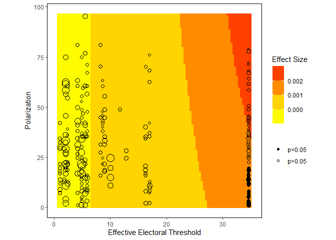

Notice that to adjust the axis labels and specify the type of the color
ramp, we use the standard `ggplot2` syntax. Here, `scale_fill_steps()`
breaks down the continuous color values into the number of categories
specified with the `n.breaks` option. To create a heatmap, we need to
replace `scale_fill_steps()` with `scale_fill_gradient()`:

    (g <- plot_me(model = m, x = "polarization", over = "threshold") + 
      scale_fill_gradient(low="yellow", high="red") +
      labs(x="Effective Electoral Threshold", y="Polarization"))

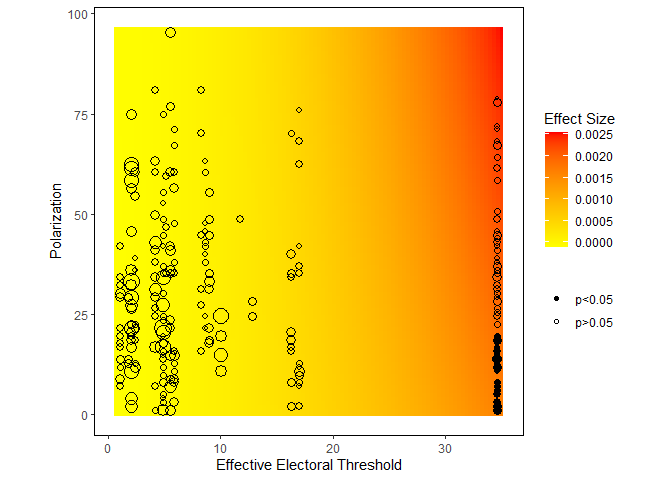

We can use `ggMarginal()` from the `ggExtra` package to attach
histograms with marginal distributions of the main covariates to the
heatmap:

    gt <- g + theme(legend.position="left")
    ggExtra::ggMarginal(gt, type="histogram", data=dt, x=threshold, y=polarization)

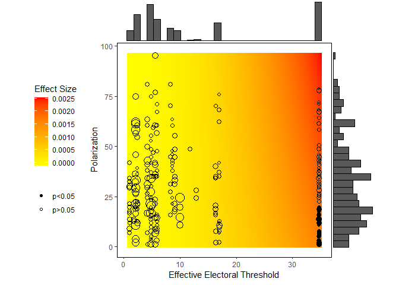

`DAME` works best with model estimates from `glm()`. When the model
estimates are produced with the `lme4` or `glmmTMB` package, we must
specify the components directly. We can extract the coefficients and
variance-covariance matrix corresponding to the fixed effects using the
`glmmTMB::fixef()` and `stats::vcov()` functions.

    coef <- fixef(m2)$cond
    vc <- vcov(m2)$cond

Since we will be setting the covariates (other than the main ones) to
their central values, we can ignore the random component of the
intercept, effectively setting the random effects to zero. To bring
these calculations closer to what is shown in the paper, we will use
simulations to produce standard errors by setting `mc=TRUE`:

    g <- plot_me(formula = pec ~ polarization*threshold + seatshare + I(seatshare^2) + 
                   incompatibility + asymmetry + asymmetry:seatshare,
            data=dt,
            coefficients=coef,
            vcov=vc,
            link="probit",
            x = "polarization", over = "threshold", mc=TRUE)
    gt <- g + scale_fill_gradient(low="yellow", high="red") +
      labs(x="Effective Electoral Threshold", y="Polarization") + 
      theme(legend.position="left")
    ggExtra::ggMarginal(gt, type="histogram", data=dt, x=threshold, y=polarization)

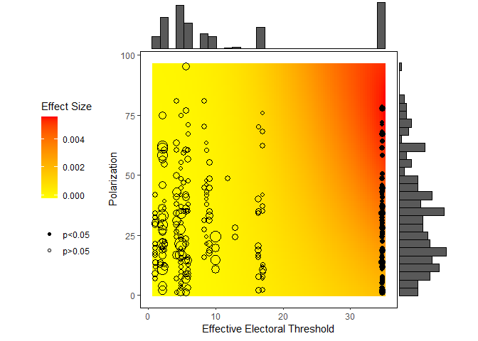

### Computing and plotting DAME of polarization

To compute the distribution-weighted average marginal effects of
`polarization`, we can resort to the `dame()` function:

    (d <- dame(model=m, x="polarization", over="threshold", nbins=10))

    ##             est           se            lb           ub bin_id
    ## 1 -7.854570e-05 0.0001810035 -0.0004333061 0.0002762147    2.0
    ## 2 -5.534738e-05 0.0001512690 -0.0003518292 0.0002411345    2.6
    ## 3 -3.853787e-05 0.0002061198 -0.0004425253 0.0003654495    4.8
    ## 4 -2.078844e-05 0.0002244287 -0.0004606606 0.0004190837    5.6
    ## 5  4.329523e-06 0.0002087581 -0.0004048289 0.0004134880    5.9
    ## 6  6.396721e-05 0.0001744165 -0.0002778829 0.0004058173    8.9
    ## 7  8.938963e-04 0.0005087583 -0.0001032517 0.0018910442   35.0

The `nbins` option allows us to create 10 bins with approximately the
same number of observations.

Likewise, we use `mem()` to compute the marginal effect of
`polarization` at its mean:

    mem <- mem(model=m, x="polarization", at=list("threshold"=seq(from=1,to=35, by=1)))

Putting both DAME and MEM on a single plot:

    ggplot(data=d, aes(x=bin_id, y=est, ymin=lb, ymax=ub)) + 
      geom_point() + 
      geom_linerange() +
      geom_line(aes(x=threshold, y=est), data=mem) +
      geom_line(aes(x=threshold, y=lb), data=mem, linetype="dashed") +
      geom_line(aes(x=threshold, y=ub), data=mem, linetype="dashed") +
      geom_hline(yintercept=0, color="red") +
      labs(x="Effective Electoral Threshold", y="ME of Polarization")

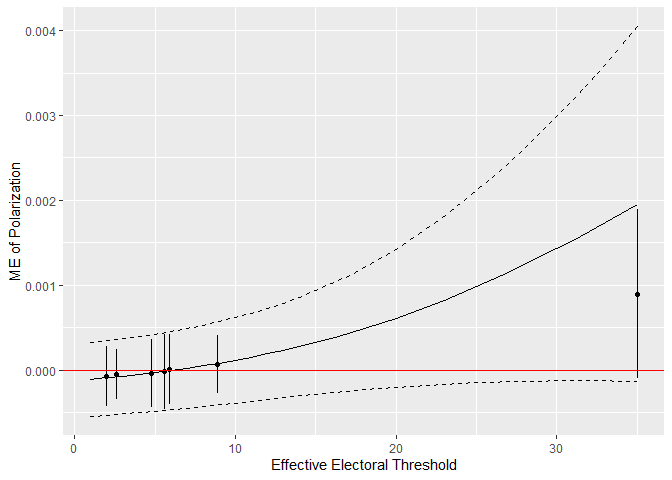

How should we deal with a model with random effects? When the estimates
are produced with `glmmTMB`, we can easily recover the estimates for the
group-specific values of the random effects (but not their sampling
distribution).

    re <- ranef(m2)$cond$ident
    dt$reff <- re[as.character(dt$ident),"(Intercept)"]

To take into account the differential intercepts for each of the groups,
we will treat random intercepts as offsets to the linear prediction and
include them in the model formula:

    d <- dame(formula = pec ~ polarization*threshold + seatshare + I(seatshare^2) + 
                incompatibility + asymmetry + asymmetry:seatshare + offset(reff) ,
            data=dt,
            coefficients=coef,
            vcov=vc,
            link="probit",
            x="polarization", over="threshold", nbins=10)
    mem <- mem(formula = pec ~ polarization*threshold + seatshare + I(seatshare^2) + 
                 incompatibility + asymmetry + asymmetry:seatshare + offset(reff),
            data=dt,
            coefficients=coef,
            vcov=vc,
            link="probit",
            x="polarization", 
            at=list("threshold"=seq(from=1,to=35, by=1)))

    # plot them
    ggplot(data=d, aes(x=bin_id, y=est, ymin=lb, ymax=ub)) + 
      geom_point() + 
      geom_linerange() +
      geom_line(aes(x=threshold, y=est), data=mem) +
      geom_line(aes(x=threshold, y=lb), data=mem, linetype="dashed") +
      geom_line(aes(x=threshold, y=ub), data=mem, linetype="dashed") +
      geom_hline(yintercept=0, color="red") +
      labs(x="Effective Electoral Threshold", y="ME of Polarization")

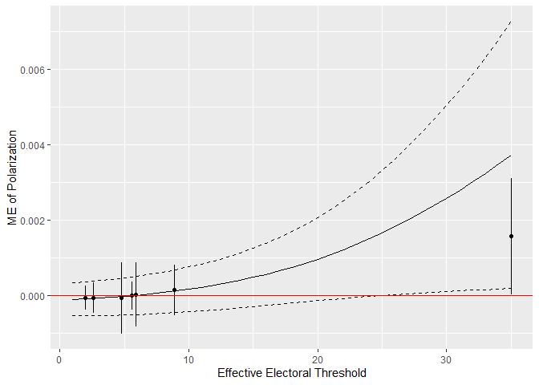

# Voter registration rules and turnout (N)

Nagler (1991) examines the interactive effect of education and the
restrictiveness of electoral registration rules on turnout. The latter
is measured using the number of days before the election when the
registration closes. This variable takes on the value of 0 when the
voters are allowed to register on the election day, and 30 means that
the registration closes 30 days before the election day. The main
hypothesis is conditional: more restrictive registration rules primarily
hurt less educated individuals.

### Load the data and estimate the model

This expectation is captured using a probit model including an
interaction term of `closing` and `neweduc`, as well as an intraction
term of `closing` and `neweduc` squared.

    dt <- readRDS("N.rds")
    dt <- subset(dt, newvote %in% 0:1, select=c("state","newvote","closing","neweduc",
                                                "age","south","gov"))
    m <- glm(newvote ~ closing*neweduc + closing*I(neweduc^2) + age + I(age^2) + south + gov,
             data=dt,
             family=binomial(link="probit"))
    summary(m)

    ## 
    ## Call:
    ## glm(formula = newvote ~ closing * neweduc + closing * I(neweduc^2) + 
    ##     age + I(age^2) + south + gov, family = binomial(link = "probit"), 
    ##     data = dt)
    ## 
    ## Deviance Residuals: 
    ##     Min       1Q   Median       3Q      Max  
    ## -2.8318  -1.0797   0.6029   0.8729   2.2440  
    ## 
    ## Coefficients:
    ##                        Estimate Std. Error z value Pr(>|z|)    
    ## (Intercept)          -2.743e+00  1.077e-01 -25.479  < 2e-16 ***
    ## closing               6.243e-04  3.721e-03   0.168   0.8668    
    ## neweduc               2.645e-01  4.184e-02   6.322 2.59e-10 ***
    ## I(neweduc^2)          5.069e-03  4.196e-03   1.208   0.2270    
    ## age                   6.966e-02  1.311e-03  53.143  < 2e-16 ***
    ## I(age^2)             -5.061e-04  1.352e-05 -37.437  < 2e-16 ***
    ## south                -1.155e-01  1.097e-02 -10.525  < 2e-16 ***
    ## gov                   3.431e-03  1.162e-02   0.295   0.7678    
    ## closing:neweduc      -3.173e-03  1.509e-03  -2.103   0.0355 *  
    ## closing:I(neweduc^2)  2.774e-04  1.518e-04   1.827   0.0677 .  
    ## ---
    ## Signif. codes:  0 '***' 0.001 '**' 0.01 '*' 0.05 '.' 0.1 ' ' 1
    ## 
    ## (Dispersion parameter for binomial family taken to be 1)
    ## 
    ##     Null deviance: 126410  on 99675  degrees of freedom
    ## Residual deviance: 111631  on 99666  degrees of freedom
    ## AIC: 111651
    ## 
    ## Number of Fisher Scoring iterations: 4

### Plotting marginal effects of the registration closing date

We can use the `plot_me()` function to draw a contour-plot for the
marginal effects of the registration closing date. Since `closing` can
only take on integer values, it makes more sense here to use the
first-difference method for calculating the marginal effect. Thus, we
set `discrete=TRUE` and use 1-day increments.

    plot_me(model = m, x = "closing", over = "neweduc", discrete = TRUE, discrete_step = 1) +
      scale_fill_steps(low="red", high="yellow", n.breaks=4) +
      labs(y="Closing Date", x="Education")

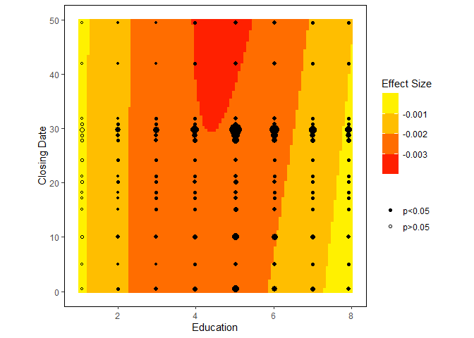

To set the dummy variables `south` and `gov` to their modes (rather than
means), we can either use the `at` option or convert them to factors
before the estimation. To use the `at` option, create a list with
medians (which are almost always equal to modes for dummy variables):

    (medians <- lapply(dt[c("south","gov")], median))

    ## $south
    ## [1] 0
    ## 
    ## $gov
    ## [1] 0

    plot_me(model = m, x = "closing", over = "neweduc", discrete = TRUE, discrete_step = 1, at=medians) +
      scale_fill_steps(low="red", high="yellow", n.breaks=4) +
      labs(y="Closing Date", x="Education")

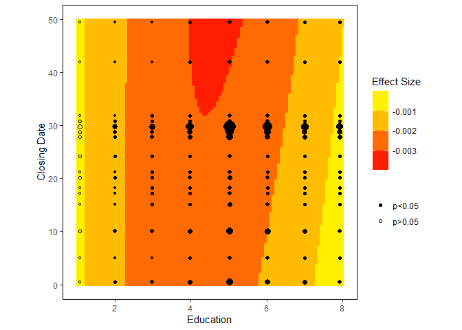

Alternatively, we could generate factor variables and use them instead
of `south` and `gov`: in this case `plot_me()` will automatically use
modes instead of means:

    dt <- within(dt, {
      south.f <- factor(south, levels=0:1)
      gov.f <- factor(gov, levels=0:1)  
    })
    m2 <- glm(newvote ~ closing*neweduc + closing*I(neweduc^2) + age + I(age^2) + south.f + gov.f,
             data=dt,
             family=binomial(link="probit"))
    plot_me(model = m2, x = "closing", over = "neweduc", discrete = TRUE, discrete_step = 1) +
      scale_fill_steps(low="red", high="yellow", n.breaks=4) +
      labs(y="Closing Date", x="Education")

### Plotting marginal effects of education

When computing the marginal effect of education, we might benefit from
keeping the same orientation of axes as before. To do so, we can use the
`coord_flip()` function from `ggplot2`.

    plot_me(model = m, x ="neweduc" , over = "closing", discrete = TRUE, discrete_step = 1, at=medians) +
      scale_fill_steps(low="yellow", high="red", n.breaks=4) +
      labs(y="Education", x="Closing Date") +
      coord_flip()

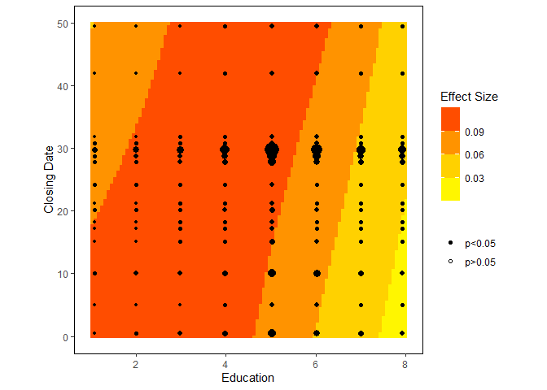

### Computing and plotting DAME of the registration closing date

Turning to DAME, we can use a similar syntax as before and, since
`neweduc` takes only 8 unique values, we can bin the observations by the
unique values of this variable (`use_distinct_values=TRUE`).

    d <- dame(model=m, x="closing", over="neweduc", 
              discrete=TRUE, discrete_step=1, 
              use_distinct_values = TRUE)
    mem <- mem(model=m, x="closing", 
               discrete=TRUE, discrete_step=1, 
               at=c(medians, list("neweduc"=sort(unique(dt$neweduc)))))

    ggplot(data=d, aes(x=bin_id, y=est, ymin=lb, ymax=ub)) + 
      geom_point() + 
      geom_linerange() +
      geom_line(aes(x=neweduc, y=est), data=mem) +
      geom_line(aes(x=neweduc, y=lb), data=mem, linetype="dashed") +
      geom_line(aes(x=neweduc, y=ub), data=mem, linetype="dashed") +
      geom_hline(yintercept=0, color="red") +
      labs(x="Education", y="ME of Closing Date")

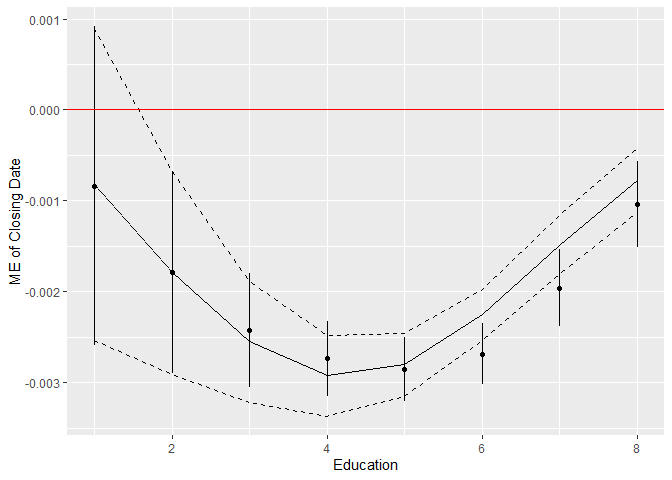

### Computing and plotting DAME of education

Change the `x`, `over`, and the values of the running variable to plot
the DAME of education:

    d <- dame(model=m, x="neweduc", over="closing", 
              discrete=TRUE, discrete_step=1)
    mem <- mem(model=m, x="neweduc", discrete=TRUE, discrete_step=1, 
               at=c(medians, list("closing"=sort(unique(dt$closing)))))

    ggplot(data=d, aes(x=bin_id, y=est, ymin=lb, ymax=ub)) + 
      geom_point() + 
      geom_linerange() +
      geom_line(aes(x=closing, y=est), data=mem) +
      geom_line(aes(x=closing, y=lb), data=mem, linetype="dashed") +
      geom_line(aes(x=closing, y=ub), data=mem, linetype="dashed") +
      geom_hline(yintercept=0, color="red") +
      labs(x="Closing Date", y="ME of Education")

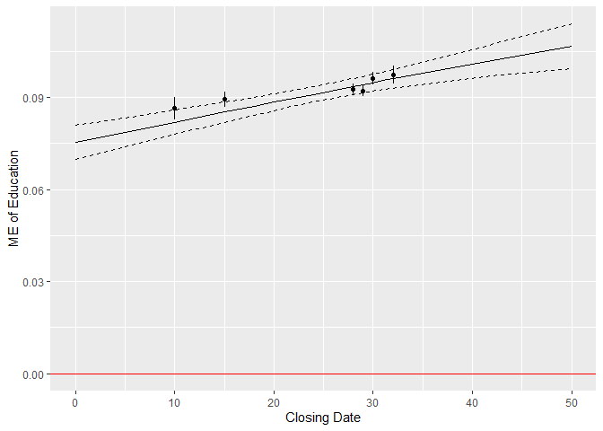

# News media and party discipline (AJLW)

Arceneaux et al. (2016) view Congressmen as facing a choice between
voting with the party and more closely following the preferences of
their constituencies. In this theory, politicians are expected to vote
with their party when they can afford to do so when the next election is
sufficiently far, their district is safe, or they can shape the public
opinion in their districts. The article presents several hypotheses
about the interactive effects of these factors; in the interest of
space, we focus here only on the interaction between the competitiveness
and the proximity of elections.

### Load the data and estimate the model

To examine the interactive effect of district competitiveness and the
proximity of the next election, following Arceneaux et al. (2016), we
subset the data and examine the Republicans from the districts in which
Fox News was present (this is another explanatory variable in the
authors’ study) and build a model explaining whether a Congressman voted
with their party and including a full interaction term of the polynomial
of the number of days until the next election and the Democratic vote
share in the preceding election in the representative’s district (the
larger this share, the more competitive the district).

Before estimating this model, we need to convert the dummy variables
representing different types of votes into a single factor variable.
This will make it easier to include them in the model and find their
central values.

    dt <- readRDS("AJLW.rds")

    # create a factor variable with the vote type
    dt$votetype <- "MiscProcedure"
    for (v in  c("Amend", "OtherPass", "ProPart", "RegPass", "Susp")) {
      dt$votetype[which(dt[[v]]==1)] <- v 
    } 

    dt <- subset(dt, PresencePartyUnity==1 & Republican==1 & FoxNews==1,
                 select=c("id","dist2","PartyVote","daystoelection","dv","Retirement",
                          "seniorit","qualchal_lag","qualchal","spendgap_lag","spendgap",
                          "distpart_lag","votetype"))
    dt <- within(dt, {
      dvprop <- dv/100
      votetype <- relevel(factor(votetype), ref="MiscProcedure")
      qualchal_lag.f <- factor(qualchal_lag, levels=0:1)
      qualchal.f <- factor(qualchal, levels=0:1)
      Retirement.f <- factor(Retirement, levels=0:1)  
      })
    dt <- na.omit(dt)

    m <- glm(PartyVote ~ dvprop*(daystoelection + I(daystoelection^2) + I(daystoelection^3)) +
               Retirement.f + seniorit + qualchal_lag.f + qualchal.f + spendgap_lag + spendgap + 
               distpart_lag + votetype,
             data=dt,
             family=binomial)
    summary(m)

    ## 
    ## Call:
    ## glm(formula = PartyVote ~ dvprop * (daystoelection + I(daystoelection^2) + 
    ##     I(daystoelection^3)) + Retirement.f + seniorit + qualchal_lag.f + 
    ##     qualchal.f + spendgap_lag + spendgap + distpart_lag + votetype, 
    ##     family = binomial, data = dt)
    ## 
    ## Deviance Residuals: 
    ##     Min       1Q   Median       3Q      Max  
    ## -3.0597   0.2351   0.3521   0.6106   1.0482  
    ## 
    ## Coefficients:
    ##                              Estimate Std. Error z value Pr(>|z|)    
    ## (Intercept)                -7.374e-02  4.802e-01  -0.154   0.8780    
    ## dvprop                      9.986e-01  1.251e+00   0.799   0.4246    
    ## daystoelection             -5.359e-03  5.009e-03  -1.070   0.2847    
    ## I(daystoelection^2)         1.575e-05  1.630e-05   0.966   0.3339    
    ## I(daystoelection^3)        -1.502e-08  1.605e-08  -0.935   0.3496    
    ## Retirement.f1               1.015e+00  2.556e-01   3.973 7.08e-05 ***
    ## seniorit                   -3.401e-02  3.634e-03  -9.361  < 2e-16 ***
    ## qualchal_lag.f1             2.340e-01  3.581e-02   6.534 6.40e-11 ***
    ## qualchal.f1                -1.628e-01  3.749e-02  -4.342 1.41e-05 ***
    ## spendgap_lag                1.669e-02  8.401e-03   1.987   0.0469 *  
    ## spendgap                   -4.771e-02  9.783e-03  -4.877 1.08e-06 ***
    ## distpart_lag                6.657e+00  2.566e-01  25.946  < 2e-16 ***
    ## votetypeAmend              -2.204e+00  9.322e-02 -23.641  < 2e-16 ***
    ## votetypeOtherPass          -9.420e-01  1.192e-01  -7.904 2.70e-15 ***
    ## votetypeProPart            -2.191e-01  1.005e-01  -2.181   0.0292 *  
    ## votetypeRegPass            -1.228e+00  1.004e-01 -12.229  < 2e-16 ***
    ## votetypeSusp               -1.044e+00  1.431e-01  -7.299 2.91e-13 ***
    ## dvprop:daystoelection       1.105e-02  1.442e-02   0.767   0.4434    
    ## dvprop:I(daystoelection^2) -4.476e-05  4.710e-05  -0.950   0.3419    
    ## dvprop:I(daystoelection^3)  5.757e-08  4.655e-08   1.237   0.2161    
    ## ---
    ## Signif. codes:  0 '***' 0.001 '**' 0.01 '*' 0.05 '.' 0.1 ' ' 1
    ## 
    ## (Dispersion parameter for binomial family taken to be 1)
    ## 
    ##     Null deviance: 43732  on 57085  degrees of freedom
    ## Residual deviance: 38692  on 57066  degrees of freedom
    ## AIC: 38732
    ## 
    ## Number of Fisher Scoring iterations: 6

The observations are clustered by districts. Thus, we need to compute a
cluster-robust variance-covariance matrix:

    vc <- sandwich::vcovCL(m, cluster= ~ dist2 )

### Plotting marginal effects of election proximity

We use the `plot_me()` function to make a heatmap for the marginal
effects of election proximity.

    plot_me(model = m, x = "daystoelection", over = "dvprop", vcov=vc) +
      scale_fill_gradient(low="yellow", high="red") +
      labs(y="Days to Election", x="Democratic Vote Share")

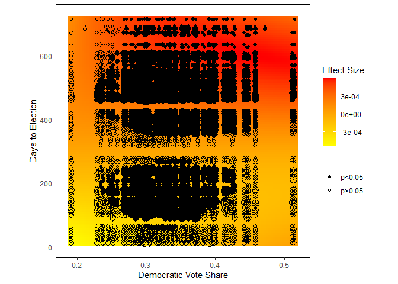
Two modifications are needed here. First, since about half of these
effects are positive, we need to use a divergent palette so that the
intensity would represent the magnitude of the effect, and the hue would
represent the direction. We can use the `scale_fill_gradient2()`
function to specify the endpoints and midpoint of the color scale.

Second, to reduce the number of markers and subsequent overplotting, we
can round the values shown on the axes:

    newdt <- within(dt, {
      daystoelection <- round(daystoelection, -1) ## round to the nearest multiple of 10
      dvprop <- round(dvprop/0.02)*0.02 ## round to the nearest multiple of 0.02
    })
    plot_me(model = m, data=newdt, x = "daystoelection", over = "dvprop", vcov=vc) +
      scale_fill_gradient2(low="blue", mid="white", high="red") +
      labs(y="Days to Election", x="Democratic Vote Share")

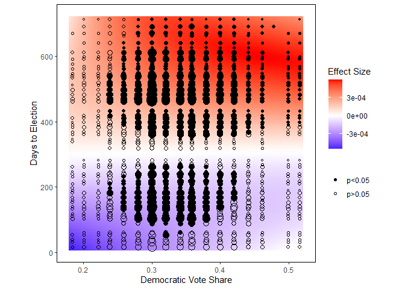

To obtain a contour-plot with a divergent scale, replace
`scale_fill_gradient2()` with `scale_fill_steps2()`:

    plot_me(model = m, data=newdt, x = "daystoelection", over = "dvprop", vcov=vc) +
      scale_fill_steps2(low="blue", mid="white", high="red", n.breaks=7) +
      labs(y="Days to Election", x="Democratic Vote Share")

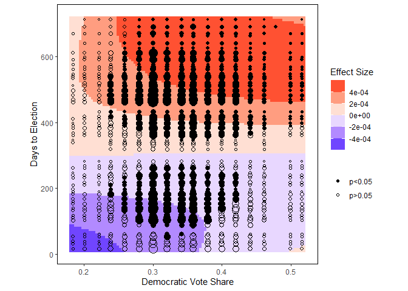

### Computing and plotting DAME of election proximity

Do not forget to specify the variance-covariance matrix when computing
DAME and MEM:

    d <- dame(model=m, x="daystoelection", over="dvprop", vcov=vc)
    ra.over <- seq(min(dt$dvprop, na.rm=TRUE), max(dt$dvprop, na.rm=TRUE), length.out=20)
    mem <- mem(model=m, x="daystoelection", vcov=vc, 
               at=list("dvprop"=ra.over))

    ggplot(data=d, aes(x=bin_id, y=est, ymin=lb, ymax=ub)) + 
      geom_point() + 
      geom_linerange() +
      geom_line(aes(x=dvprop, y=est), data=mem) +
      geom_line(aes(x=dvprop, y=lb), data=mem, linetype="dashed") +
      geom_line(aes(x=dvprop, y=ub), data=mem, linetype="dashed") +
      geom_hline(yintercept=0, color="red") +
      labs(x="Democratic Vote Share", y="ME of Election Proximity")

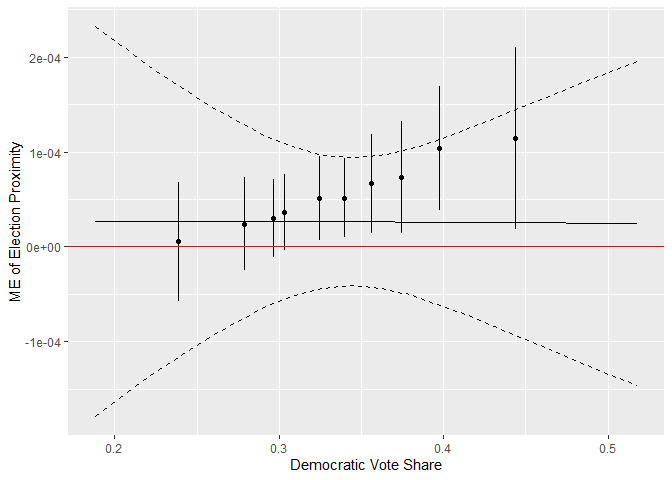

# Foreign direct investment and labor protest (RT)

Robertson and Teitelbaum (2011) study the response of the local labor to
foreign direct investment. The article argues that FDI flows lead to
more labor protests, and this effect is more substantial when there are
fewer democratic means for resolving such conflicts.

### Load the data and estimate the model

Since the dependent variable is a count of protests, we use a negative
binomial regression. The right-hand side of the model equation includes
an interaction of political regime (Polity 2 score) and the natural log
of FDI flow: we expect the latter’s effect to be conditional on the
values of the former.

    dt <- readRDS("RT.rds")
    current_vals <- dt[,c("isocode","year","dispute","open_penn","l_gdp_pc_penn","gdp_grth",
                          "inflation_1","urban","xratchg","l_pop","time")]
    lagged_vals <- within(dt, {
      year <- year + 1L
      l_l_flows <- l_flows
      l_polity2 <- polity2
      l_dispute <- dispute 
    })[c("isocode","year","l_l_flows","l_polity2","l_dispute")] 
    dt <- merge(current_vals, lagged_vals, by=c("isocode","year"))
    dt <- na.omit(dt)

    library(MASS)
    m <- glm.nb(dispute ~ l_l_flows*l_polity2 + l_dispute + open_penn + l_gdp_pc_penn + 
                  gdp_grth + inflation_1 + urban + xratchg + l_pop + time,
             data=dt )
    summary(m)

    ## 
    ## Call:
    ## glm.nb(formula = dispute ~ l_l_flows * l_polity2 + l_dispute + 
    ##     open_penn + l_gdp_pc_penn + gdp_grth + inflation_1 + urban + 
    ##     xratchg + l_pop + time, data = dt, init.theta = 0.3997142679, 
    ##     link = log)
    ## 
    ## Deviance Residuals: 
    ##     Min       1Q   Median       3Q      Max  
    ## -1.8660  -0.4005  -0.2286  -0.1056   6.3269  
    ## 
    ## Coefficients:
    ##                       Estimate Std. Error z value Pr(>|z|)    
    ## (Intercept)         -1.724e+01  1.950e+00  -8.839  < 2e-16 ***
    ## l_l_flows            1.508e-01  6.132e-02   2.460 0.013896 *  
    ## l_polity2            1.872e-01  4.030e-02   4.645 3.40e-06 ***
    ## l_dispute            3.391e-01  3.205e-02  10.580  < 2e-16 ***
    ## open_penn           -5.637e-04  1.880e-03  -0.300 0.764346    
    ## l_gdp_pc_penn        2.981e-01  1.829e-01   1.630 0.103171    
    ## gdp_grth            -4.039e-04  1.755e-02  -0.023 0.981640    
    ## inflation_1          9.812e-05  7.645e-05   1.284 0.199305    
    ## urban                2.267e-02  6.359e-03   3.565 0.000364 ***
    ## xratchg             -7.718e-04  4.401e-03  -0.175 0.860797    
    ## l_pop                6.341e-01  7.802e-02   8.127 4.38e-16 ***
    ## time                -1.171e-02  1.408e-02  -0.832 0.405371    
    ## l_l_flows:l_polity2 -1.948e-02  6.104e-03  -3.192 0.001415 ** 
    ## ---
    ## Signif. codes:  0 '***' 0.001 '**' 0.01 '*' 0.05 '.' 0.1 ' ' 1
    ## 
    ## (Dispersion parameter for Negative Binomial(0.3997) family taken to be 1)
    ## 
    ##     Null deviance: 1501.51  on 2347  degrees of freedom
    ## Residual deviance:  634.28  on 2335  degrees of freedom
    ## AIC: 1607.2
    ## 
    ## Number of Fisher Scoring iterations: 1
    ## 
    ## 
    ##               Theta:  0.3997 
    ##           Std. Err.:  0.0546 
    ## 
    ##  2 x log-likelihood:  -1579.1580

The article employs a more complicated version of this model with
country-specific random effects. As earlier, we can estimate such a
model with the `glmmTMB()` function from the `glmmTMB` package.

    library(glmmTMB)
    m2 <- glmmTMB(dispute ~ l_l_flows*l_polity2 + l_dispute + open_penn + l_gdp_pc_penn + 
                    gdp_grth + inflation_1 + urban + xratchg + l_pop + time + (1|isocode), 
                  family=nbinom1, data=dt)
    summary(m2)

    ##  Family: nbinom1  ( log )
    ## Formula:          
    ## dispute ~ l_l_flows * l_polity2 + l_dispute + open_penn + l_gdp_pc_penn +  
    ##     gdp_grth + inflation_1 + urban + xratchg + l_pop + time +  
    ##     (1 | isocode)
    ## Data: dt
    ## 
    ##      AIC      BIC   logLik deviance df.resid 
    ##   1484.7   1571.1   -727.3   1454.7     2333 
    ## 
    ## Random effects:
    ## 
    ## Conditional model:
    ##  Groups  Name        Variance Std.Dev.
    ##  isocode (Intercept) 1.576    1.255   
    ## Number of obs: 2348, groups:  isocode, 131
    ## 
    ## Dispersion parameter for nbinom1 family (): 1.19 
    ## 
    ## Conditional model:
    ##                       Estimate Std. Error z value Pr(>|z|)    
    ## (Intercept)         -1.744e+01  3.236e+00  -5.390 7.07e-08 ***
    ## l_l_flows            3.382e-01  8.686e-02   3.894 9.87e-05 ***
    ## l_polity2            2.551e-01  6.007e-02   4.247 2.17e-05 ***
    ## l_dispute            5.996e-02  1.648e-02   3.637 0.000275 ***
    ## open_penn           -1.445e-03  3.568e-03  -0.405 0.685382    
    ## l_gdp_pc_penn        9.334e-02  2.741e-01   0.340 0.733487    
    ## gdp_grth            -2.570e-02  1.626e-02  -1.580 0.114100    
    ## inflation_1          1.147e-04  6.852e-05   1.674 0.094076 .  
    ## urban                1.692e-02  1.094e-02   1.546 0.122083    
    ## xratchg              1.383e-03  4.104e-03   0.337 0.736148    
    ## l_pop                6.491e-01  1.468e-01   4.422 9.80e-06 ***
    ## time                 2.143e-02  1.703e-02   1.258 0.208211    
    ## l_l_flows:l_polity2 -2.973e-02  8.618e-03  -3.450 0.000560 ***
    ## ---
    ## Signif. codes:  0 '***' 0.001 '**' 0.01 '*' 0.05 '.' 0.1 ' ' 1

### Plotting marginal effects of logged FDI flows

To plot the marginal effects from the negative binomial regression
estimated using `glm.nb()`, we can use the standard syntax of
`plot_me()`, with the exception of the dataset, which needs to be
specified directly.

    g <- plot_me(model = m, data=dt, x = "l_l_flows", over = "l_polity2")
    gt <- g + 
      scale_fill_gradient(low="yellow", high="red") +
      labs(x="Polity score", y="log(FDI flows)") + 
      theme(legend.position="left")
    ggExtra::ggMarginal(gt, type="histogram", data=dt, x=l_polity2, y=l_l_flows)

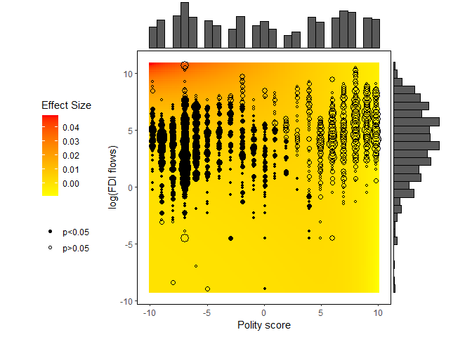

To plot a heatmap for the random effects model, we need to extract the
coefficients and the variance-covariance matrix.

    coef <- glmmTMB::fixef(m2)$cond
    vc <- vcov(m2)$cond
    g <- plot_me(formula = dispute ~ l_l_flows*l_polity2 + l_dispute + open_penn + 
                   l_gdp_pc_penn + gdp_grth + inflation_1 + urban + xratchg + l_pop + time,
            data=dt,
            coefficients=coef,
            vcov=vc,
            link="log",
            x = "l_l_flows", over = "l_polity2")
    gt <- g + 
      scale_fill_gradient(low="yellow", high="red") +
      labs(x="Polity score", y="log(FDI flows)") + 
      theme(legend.position="left")
    ggExtra::ggMarginal(gt, type="histogram", data=dt, x=l_polity2, y=l_l_flows)

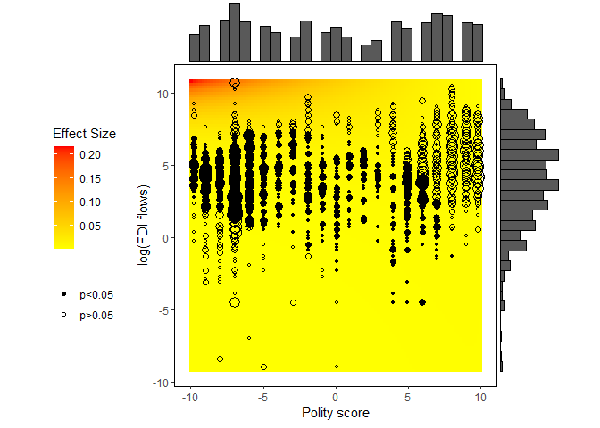

The figure in Zhirnov, Moral, and Sedashov (2022) uses binned values of
logged FDI flows to reduce overplotting and applies simulations instead
of the delta method for computing the standard errors. We can replicate
these calculations in R by binning the values of `l_l_flows` and setting
`mc=TRUE` in the `plot_me()` function (please note that the parameter
estimates produced with `glmmTMB` and `lme4` are slightly different from
Stata’s estimates shown in the paper, which also leads to varied
marginal effect estimates):

    mcut <- cut(dt$l_l_flows, breaks=seq(from=-11.22, to=11.22, by=2))
    binned <- tapply(dt$l_l_flows, INDEX=mcut, FUN=mean, na.rm=TRUE) 
    dt2 <- within(dt, {
      l_l_flows <- binned[mcut] 
    })

    g <- plot_me(formula = dispute ~ l_l_flows*l_polity2 + l_dispute + open_penn + 
                   l_gdp_pc_penn + gdp_grth + inflation_1 + urban + xratchg + l_pop + time,
            data=dt2,
            coefficients=coef,
            vcov=vc,
            link="log",
            x = "l_l_flows", over = "l_polity2", mc=TRUE)

    gt <- g + 
      scale_fill_gradient(low="yellow", high="red") +
      labs(x="Polity score", y="log(FDI flows)") + 
      theme(legend.position="left")
    ggExtra::ggMarginal(gt, type="histogram", data=dt, x=l_polity2, y=l_l_flows)

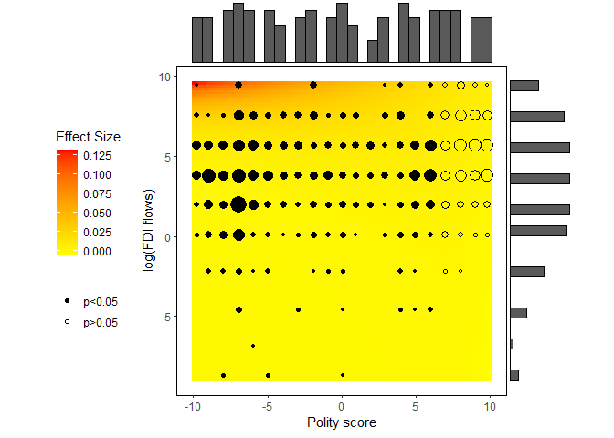

### Computing and plotting DAME of logged FDI flows

As earlier, we will include the group-specific components of intercepts
as the offset.

    re <- ranef(m2)$cond$isocode
    dt$reff <- re[dt$isocode,"(Intercept)"]

    d <- dame(formula = dispute ~ l_l_flows*l_polity2 + l_dispute + open_penn + 
                l_gdp_pc_penn + gdp_grth + inflation_1 + urban + xratchg + l_pop + 
                time + offset(reff),
            data=dt,
            coefficients=coef,
            vcov=vc,
            link="log",
            x="l_l_flows", over="l_polity2", nbins=4, mc=TRUE)
    mem <- mem(formula = dispute ~ l_l_flows*l_polity2 + l_dispute + open_penn + 
                 l_gdp_pc_penn + gdp_grth + inflation_1 + urban + xratchg + l_pop + 
                 time + offset(reff),
            data=dt,
            coefficients=coef,
            vcov=vc,
            link="log", x="l_l_flows", mc=TRUE, at=list("l_polity2"=seq(from=-10,to=10, by=1)))

    ggplot(data=d, aes(x=bin_id, y=est, ymin=lb, ymax=ub)) + 
      geom_point() + 
      geom_linerange() +
      geom_line(aes(x=l_polity2, y=est), data=mem) +
      geom_line(aes(x=l_polity2, y=lb), data=mem, linetype="dashed") +
      geom_line(aes(x=l_polity2, y=ub), data=mem, linetype="dashed") + 
      geom_hline(yintercept=0, color="red") +
      labs(x="Polity score", y="ME of log(FDI flows)")

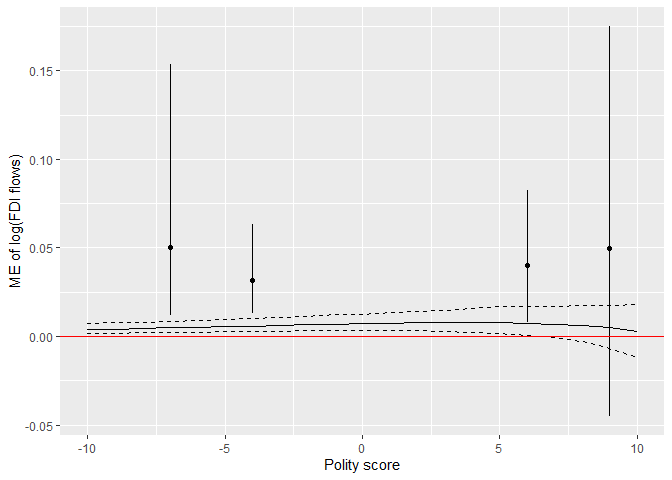

# This document

This document was produced with RMarkdown Xie (2021) using R version
4.1.0.

# References

Allaire, JJ, Yihui Xie, Jonathan McPherson, Javier Luraschi, Kevin
Ushey, Aron Atkins, Hadley Wickham, Joe Cheng, Winston Chang, and
Richard Iannone. 2021. *Rmarkdown: Dynamic Documents for r*.
<https://github.com/rstudio/rmarkdown>.

Arceneaux, Kevin, Martin Johnson, Rene Lindstädt, and Ryan J. Vander
Wielen. 2016. “The Influence of News Media on Political Elites:
Investigating Strategic Responsiveness in Congress.” *American Journal
of Political Science* 60 (1): 5–29.

Attali, Dean, and Christopher Baker. 2019. *ggExtra: Add Marginal
Histograms to Ggplot2, and More Ggplot2 Enhancements*.
<https://github.com/daattali/ggExtra>.

Berry, William, Jacqueline DeMeritt, and Justin Esarey. 2010. “Testing
for Interaction in Binary Logit and Probit Models: Is a Product Term
Essential?” *American Journal of Political Science* 54 (1): 248–66.

Golder, Sona. 2006. *The Logic of Pre-Electoral Coalition Formation*.
Columbus: Ohio State University Press.

Kuriwaki, Shiro, Will Beasley, Thomas J. Leeper, Philip Durbin, and
Sebastian Karcher. 2021. *Dataverse: Client for Dataverse 4+
Repositories*. <https://CRAN.R-project.org/package=dataverse>.

Magnusson, Arni, Hans Skaug, Anders Nielsen, Casper Berg, Kasper
Kristensen, Martin Maechler, Koen van Bentham, Ben Bolker, and Mollie
Brooks. 2021. *glmmTMB: Generalized Linear Mixed Models Using Template
Model Builder*. <https://github.com/glmmTMB/glmmTMB>.

Nagler, Jonathan. 1991. “The Effect of Registration Laws and Education
on u.s. Voter Turnout.” *American Political Science Review* 85 (4):
1393–1405.

R Core Team. 2020. *Foreign: Read Data Stored by Minitab, s, SAS, SPSS,
Stata, Systat, Weka, dBase, ...*
<https://svn.r-project.org/R-packages/trunk/foreign/>.

———. 2021. *R: A Language and Environment for Statistical Computing*.
Vienna, Austria: R Foundation for Statistical Computing.
<https://www.R-project.org/>.

Ripley, Brian. 2021. *MASS: Support Functions and Datasets for Venables
and Ripley’s MASS*. <http://www.stats.ox.ac.uk/pub/MASS4/>.

Robertson, Graeme B., and Emmanuel Teitelbaum. 2011. “Foreign Direct
Investment, Regime Type, and Labor Protest in Developing Countries.”
*American Journal of Political Science* 55 (3): 665–77.

Wickham, Hadley, Winston Chang, Lionel Henry, Thomas Lin Pedersen,
Kohske Takahashi, Claus Wilke, Kara Woo, Hiroaki Yutani, and Dewey
Dunnington. 2021. *Ggplot2: Create Elegant Data Visualisations Using the
Grammar of Graphics*. <https://CRAN.R-project.org/package=ggplot2>.

Xie, Yihui. 2021. *Knitr: A General-Purpose Package for Dynamic Report
Generation in r*. <https://yihui.org/knitr/>.

Zeileis, Achim, and Thomas Lumley. 2021. *Sandwich: Robust Covariance
Matrix Estimators*. <https://sandwich.R-Forge.R-project.org/>.

Zhirnov, Andrei, Mert Moral, and Evgeny Sedashov. 2022. “Taking
Distributions Seriously: On the Interpretation of the Estimates of
Interactive Nonlinear Models.” *Political Analysis (Conditional
Acceptance)*.
